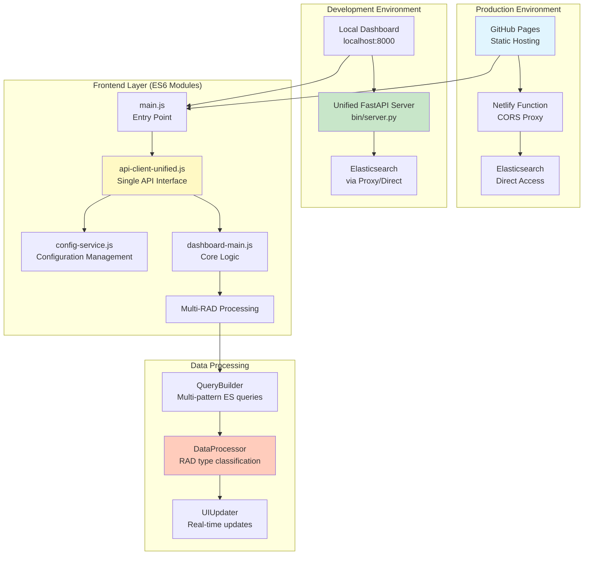
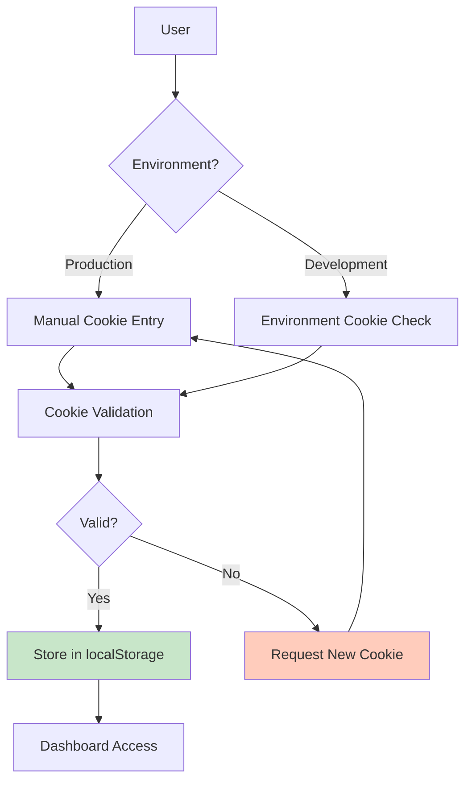
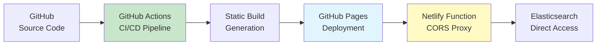
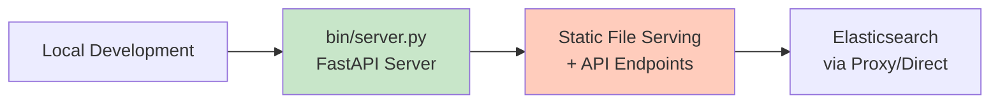

# RAD Monitor Dashboard - Architecture Documentation

## Overview

The RAD Monitor Dashboard is a sophisticated real-time monitoring system for multiple RAD (Recommendation and Discovery) event types. This document consolidates all architectural decisions, system design, and implementation patterns.

**Current Status**: Post-consolidation architecture (Phases 1-3 complete, Phase 4 in progress)

---

## System Architecture

### High-Level Architecture



### Core Principles

1. **Simplification First**: Remove complexity, don't add it
2. **Single Responsibility**: Each component has one clear purpose
3. **Modern Standards**: Pure ES6 modules, no legacy patterns
4. **Unified Interfaces**: Single API client, single server, single config service
5. **Multi-RAD Awareness**: Built-in support for multiple recommendation systems

---

## Frontend Architecture

### Module System (Phase 4: Frontend Consolidation)

**Before Consolidation** (Legacy):
```
IIFE patterns everywhere
Multiple API clients (api-client.js, api-client-fastapi.js, api-client-enhanced.js)
Global window pollution (window.Dashboard, window.ApiClient, etc.)
Mixed module patterns (AMD, CommonJS, IIFE, ES6)
```

**After Consolidation** (Current):
```
Pure ES6 modules throughout
Single unified API client (api-client-unified.js)
Clean import/export only
No global pollution
Standardized module patterns
```

#### Key Files

| File | Purpose | Status | Notes |
|------|---------|--------|-------|
| `main.js` | Entry point, module loader | (✓) Pure ES6 | No window assignments |
| `api-client-unified.js` | Single API interface | (✓) Complete | Replaces 3 old clients |
| `config-service.js` | Configuration management | (✓) Pure ES6 | Unified config source |
| `dashboard-main.js` | Core dashboard logic | (✓) Pure ES6 | No IIFE patterns |
| `data-layer.js` | State management | (✓) Modern | Event-driven architecture |

### API Client Architecture

**Unified API Client Design:**
```javascript
// Single client handles all environments
class UnifiedAPIClient {
  // Auto-detects: localhost vs GitHub Pages
  // Handles: WebSocket, HTTP, Proxy routing
  // Manages: Authentication, caching, errors
  // Supports: Multi-RAD queries, real-time updates
}
```

**Benefits:**
- (✓) Single point of API communication
- (✓) Environment auto-detection
- (✓) Consistent error handling
- (✓) Built-in performance monitoring
- (✓) WebSocket support for real-time updates

---

## Backend Architecture

### Server Consolidation (Phase 3: Backend Consolidation)

**Before Consolidation** (Legacy):
```
bin/dev_server.py (old server)
bin/cors_proxy.py (CORS handling)
bin/centralized_api.py (API endpoints)
bin/dev_server_fastapi.py (FastAPI integration)
src/api/ (API modules)
src/data/ (Data models)
```

**After Consolidation** (Current):
```
bin/server.py (unified FastAPI server)
- All API endpoints
- WebSocket support
- Static file serving
- Built-in CORS handling
- Multi-RAD query support
```

#### Unified Server Features

```python
# bin/server.py - Single FastAPI application
- REST API endpoints under /api/v1/
- WebSocket endpoint at /ws
- Static file serving for development
- CORS middleware for cross-origin requests
- OpenAPI documentation at /docs
- Health checks and metrics
- Multi-RAD configuration endpoints
```

**Benefits:**
- (✓) Single process to manage
- (✓) Consistent error handling
- (✓) Built-in API documentation
- (✓) WebSocket real-time support
- (✓) Simplified deployment

---

## Multi-RAD Support Architecture

### RAD Type Configuration

The system supports multiple RAD (Recommendation and Discovery) event types:

```javascript
// ConfigService - RAD type definitions
rad_types: {
  venture_feed: {
    pattern: 'pandc.vnext.recommendations.feed.feed*',
    display_name: 'Venture Feed',
    enabled: true,
    color: '#4CAF50',
    description: 'Venture recommendations feed'
  },
  venture_metrics: {
    pattern: 'pandc.vnext.recommendations.metricsevolved*',
    display_name: 'Venture Metrics',
    enabled: true,
    color: '#9C27B0',
    description: 'Venture metrics evolved events'
  },
  cart_recommendations: {
    pattern: 'pandc.vnext.recommendations.cart*',
    display_name: 'Cart Recommendations',
    enabled: false,  // Available but not active by default
    color: '#2196F3',
    description: 'Shopping cart recommendations'
  },
  product_recommendations: {
    pattern: 'pandc.vnext.recommendations.product*',
    display_name: 'Product Recommendations',
    enabled: false,  // Available but not active by default
    color: '#FF9800',
    description: 'Product page recommendations'
  }
}
```

### Multi-Pattern Query System

```javascript
// QueryBuilder supports multiple patterns via OR logic
class QueryBuilder {
  multiWildcard(patterns) {
    // Generates ES query with multiple wildcard patterns
    // Enables monitoring multiple RAD types simultaneously
    return {
      query: {
        bool: {
          should: patterns.map(pattern => ({
            wildcard: { "event_id": pattern }
          }))
        }
      }
    }
  }
}
```

### Data Processing Pipeline


---

## Data Layer Architecture

### State Management

**Event-Driven Architecture:**
```javascript
// DataLayer - Central state management
class DataLayer {
  // Event system for reactive updates
  addEventListener(event, handler)
  removeEventListener(event, handler)

  // State management
  fetchAndParse(queryId, queryConfig)
  updateAppConfig(config)

  // Performance monitoring
  getPerformanceMetrics()
  getQueryState()
}
```

**Key Events:**
- `searchComplete` - Data fetch successful
- `error` - Query or processing errors
- `stateChange` - Configuration updates
- `configUpdate` - Multi-RAD config changes

### Caching Strategy

```javascript
// Multi-level caching
1. Browser Cache (5 minutes TTL)
2. Query Result Cache (configurable)
3. Configuration Cache (persistent)
4. Performance Metrics Cache (session)
```

---

## Security Architecture

### Authentication Flow



### Security Measures

1. **Cookie Management:**
   - 24-hour expiration
   - Automatic cleanup
   - Validation before storage
   - Environment-aware handling

2. **CORS Protection:**
   - Netlify proxy for production
   - Restricted origins
   - Proper preflight handling

3. **Input Validation:**
   - Pydantic models for API validation
   - Client-side input sanitization
   - Query parameter validation

---

## Configuration Architecture

### Configuration Hierarchy

```mermaid
graph TB
    A[Default Config<br/>getDefaultConfig()] --> B[Environment Detection<br/>production vs development]
    B --> C{Environment}
    C -->|Production| D[Load production.json]
    C -->|Development| E[Load from Backend API]
    D --> F[Merge with Defaults]
    E --> F
    F --> G[Save to localStorage]
    G --> H[ConfigService Ready]

    style D fill:#e1f5fe
    style E fill:#c8e6c9
    style H fill:#c8e6c9
```

### Configuration Sources

1. **Defaults** (`getDefaultConfig()`)
   - Baseline configuration
   - Multi-RAD type definitions
   - Default thresholds and settings

2. **Production** (`config/production.json`)
   - GitHub Pages deployment settings
   - Proxy URLs and endpoints
   - Production-specific overrides

3. **Development** (Backend API)
   - Local development settings
   - FastAPI server configuration
   - Development feature flags

4. **Runtime** (localStorage)
   - User preferences
   - Session-specific settings
   - Cached configuration

---

## Testing Architecture

### Current Status (Phase 5: Critical)

**Test Infrastructure:**
- **Framework**: Vitest with jsdom environment
- **Coverage**: v8 provider with HTML/JSON reporting
- **Setup**: Enhanced setup-improved.js with comprehensive mocks
- **Organization**: Unit/Integration/E2E separation

**Critical Issues** (Being addressed):
- All 32 test files failing due to ES6 migration
- Import path mismatches after IIFE cleanup
- Missing test utilities (`tests/utils/test-helpers.js`)

**Recovery Plan:**
1. **Sub-Phase 5A**: Emergency test fixes (create missing utilities, fix imports)
2. **Sub-Phase 5B**: Test stabilization (update mocks for unified architecture)
3. **Sub-Phase 5C**: Quality gates (coverage targets, test organization)

---

## Performance Architecture

### Optimization Strategies

1. **Frontend Performance:**
   - ES6 module tree-shaking
   - Lazy loading for non-critical components
   - Efficient DOM updates with DocumentFragment
   - Virtual scrolling for large data sets

2. **Backend Performance:**
   - FastAPI async/await patterns
   - Connection pooling for Elasticsearch
   - Response caching with configurable TTL
   - Query optimization for multi-pattern searches

3. **Network Performance:**
   - CORS proxy caching
   - WebSocket for real-time updates
   - Compressed API responses
   - Static asset optimization

### Monitoring

```javascript
// Built-in performance monitoring
const metrics = DataLayer.getPerformanceMetrics();
// Returns: query times, cache hit rates, error rates, etc.
```

---

## Deployment Architecture

### Production Deployment



**Deployment Flow:**
1. Push to `main` branch
2. GitHub Actions builds static assets
3. Deploys to GitHub Pages
4. Netlify function handles CORS/auth
5. Direct Elasticsearch access for queries

### Development Deployment



**Development Flow:**
1. `npm run dev` starts unified server
2. Serves static files + API endpoints
3. WebSocket for real-time updates
4. Auto-reload for development

---

## Migration Status

### Completed Phases

- (✓) **Phase 1**: Immediate cleanup (dead code removal)
- (✓) **Phase 2**: Multi-RAD support implementation
- (✓) **Phase 3**: Backend consolidation (unified server)
- (in progress) **Phase 4**: Frontend consolidation (in progress - ES6 migration)

### Current Focus

**Phase 4: Frontend Consolidation**
- Agent 1 executing IIFE to ES6 migration
- Converting 37 files from legacy patterns to pure ES6
- Removing global pollution (`window.` assignments)
- Standardizing module imports/exports

### Next Phases

- **Phase 5**: Testing & Quality (emergency test fixes needed)
- **Phase 6**: Security enhancements
- **Phase 7**: Performance optimization
- **Phase 8**: Documentation completion
- **Phase 9-11**: Advanced features

---

## Technical Debt

### Resolved Issues

1. (✓) **Multiple API Clients**: Consolidated to single unified client
2. (✓) **Scattered Backend Services**: Unified to single FastAPI server
3. (✓) **Mixed Module Patterns**: Standardized to pure ES6
4. (✓) **Configuration Fragmentation**: Centralized ConfigService
5. (✓) **Global Pollution**: Eliminated window assignments

### Remaining Issues

1. (in progress) **Test Infrastructure**: 32 failing tests (Phase 5 priority)
2. (in progress) **IIFE Patterns**: 35 files still being converted by Agent 1
3. (pending) **Legacy API References**: Cleanup after ES6 migration complete
4. (pending) **Performance Optimization**: After core stability achieved

---

## Design Decisions

### Why Unified Architecture?

1. **Reduced Complexity**: Single API client vs 3 different clients
2. **Easier Maintenance**: One server vs multiple Python services
3. **Better Testing**: Consistent patterns make testing simpler
4. **Improved Performance**: Fewer HTTP requests, better caching
5. **Developer Experience**: Clear patterns, single entry points

### Why Multi-RAD Support?

1. **Business Value**: Monitor multiple recommendation systems
2. **Operational Efficiency**: Single dashboard for all RAD types
3. **Pattern Reusability**: Same monitoring logic across different events
4. **Scalability**: Easy to add new RAD types
5. **Cost Effectiveness**: One system vs multiple dashboards

### Why ES6 Module Migration?

1. **Modern Standards**: Align with current JavaScript best practices
2. **Better Tooling**: Improved IDE support, tree-shaking, bundling
3. **Maintainability**: Clear imports/exports vs global pollution
4. **Performance**: Better optimization by bundlers
5. **Future-Proofing**: Easier migration to TypeScript/React if needed

---

## Lessons Learned

### What Worked Well

1. **Phased Migration**: Incremental changes reduced risk
2. **Backward Compatibility**: Maintained functionality during transitions
3. **Clear Documentation**: Architecture decisions tracked and communicated
4. **Automated Testing**: Caught regressions early (when tests work!)
5. **Simplification Focus**: Removing complexity improved maintainability

### What Challenged Us

1. **Test Dependency Chain**: ES6 migration broke test imports
2. **Configuration Complexity**: Multiple config sources needed careful coordination
3. **Module Interdependencies**: IIFE removal required systematic approach
4. **Legacy Pattern Cleanup**: More files affected than initially estimated

### Key Insights

1. **Start with Tests**: Fix test infrastructure before major refactoring
2. **Document Dependencies**: Track which components depend on which
3. **Plan for Rollback**: Keep old patterns working until new ones proven
4. **Measure Performance**: Changes should improve or maintain performance
5. **Coordinate Changes**: Large refactoring needs careful sequencing

---

## Future Architecture Considerations

### Potential Improvements

1. **TypeScript Migration**: For better type safety and developer experience
2. **React/Vue Components**: For complex UI interactions
3. **GraphQL**: For flexible data querying
4. **Service Workers**: For offline functionality
5. **WebAssembly**: For performance-critical data processing

### Scaling Considerations

1. **Microservices**: If backend becomes too complex
2. **Message Queues**: For high-volume real-time processing
3. **CDN Integration**: For global performance
4. **Database Caching**: Redis for frequent queries
5. **Container Deployment**: Docker for consistent environments

---

## Architecture Validation

### Health Checks

1. **Frontend Health**: ES6 module loading, API connectivity
2. **Backend Health**: FastAPI endpoints, Elasticsearch connectivity
3. **Integration Health**: End-to-end data flow validation
4. **Performance Health**: Response times, memory usage
5. **Security Health**: Authentication flows, CORS policies

### Monitoring Points

1. **Application Metrics**: Dashboard.getHealthStatus()
2. **Performance Metrics**: DataLayer.getPerformanceMetrics()
3. **Error Rates**: API success/failure ratios
4. **User Experience**: Page load times, interaction responsiveness
5. **Resource Usage**: Memory, CPU, network utilization

---

**Document Status**: Living document, updated as architecture evolves
**Last Updated**: 2025-06-30 (Phase 4 in progress)
**Next Review**: After Phase 5 test infrastructure recovery
