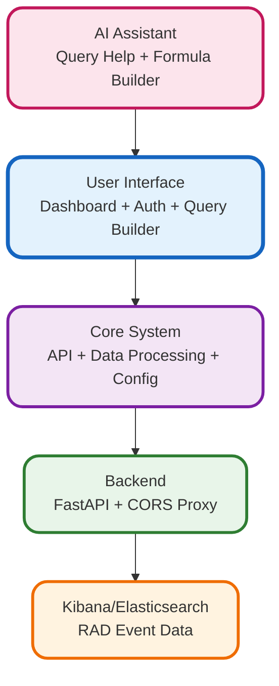

# RAD Traffic Monitor Architecture

A simplified view of the monitoring dashboard architecture for Zoom presentations.

## Key Components

### Frontend
- **Dashboard**: Real-time RAD card traffic visualization
- **Auth Modal**: Kibana cookie synchronization
- **Formula Builder**: Natural language to query translation

### Core System
- **API Client**: Unified interface for all data requests
- **Data Layer**: Processes and formats RAD metrics
- **Config Manager**: Centralized settings management

### Backend Services
- **FastAPI Server**: Python backend for data processing
- **CORS Proxy**: Netlify function to bypass CORS restrictions

### External Systems
- **Kibana**: Source of RAD card event data
- **Elasticsearch**: Direct metrics queries

### AI
- **MCP Services**: 6 AI modules for enhanced functionality
- **Formula AI**: Helps users build complex queries easily

## Quick Stats
- **Total Files**: ~290 (excluding dependencies)
- **Languages**: JavaScript, Python, TypeScript
- **Test Coverage**: 50+ test files
- **Deployment**: GitHub Pages for now

## Benefits for RAD Monitoring
1. **Real-time Visibility** - Instant alerts for traffic drops
2. **Easy Querying** - No Kibana syntax knowledge required
3. **Direct Integration** - Seamless Kibana/ES connection
4. **AI Assistance** - Smart query building and suggestions
