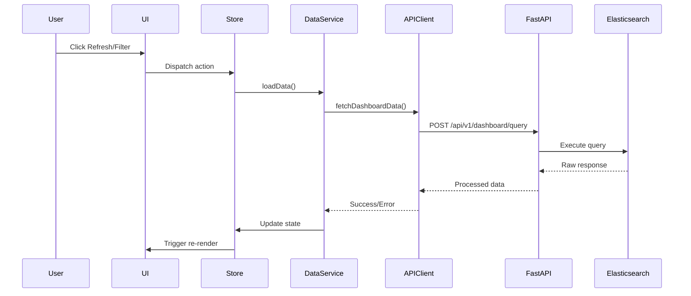
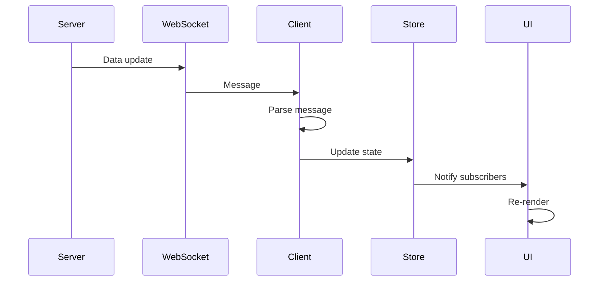

# RAD Monitor - Complete Data Flow and State Management Documentation

## Table of Contents
1. [Architecture Overview](#architecture-overview)
2. [Data Flow Journey](#data-flow-journey)
3. [State Management with Zustand](#state-management-with-zustand)
4. [Data Transformation Pipeline](#data-transformation-pipeline)
5. [Real-time Data Flow](#real-time-data-flow)
6. [Code Examples](#code-examples)

## Architecture Overview

The RAD Monitor application follows a client-server architecture with multiple layers of data processing and state management:

```
┌─────────────────────────────────────────────────────────────────────┐
│                           USER INTERFACE                             │
│  ┌─────────────┐  ┌──────────────┐  ┌────────────┐  ┌────────────┐│
│  │   HTML      │  │  Web Components│  │  Dashboard │  │  Formula   ││
│  │   (index)   │  │  (Antares)    │  │  Tables    │  │  Builder   ││
│  └──────┬──────┘  └───────┬──────┘  └──────┬─────┘  └──────┬─────┘│
└─────────┼──────────────────┼───────────────┼────────────────┼──────┘
          │                  │               │                │
┌─────────┴──────────────────┴───────────────┴────────────────┴──────┐
│                         STATE MANAGEMENT                            │
│  ┌────────────────────────────────────────────────────────────────┐│
│  │                    Zustand Store (app-store.js)                 ││
│  │  ┌──────────┐  ┌────────────┐  ┌──────────┐  ┌──────────────┐ ││
│  │  │   Auth   │  │ Connection │  │    UI    │  │     Data     │ ││
│  │  │  State   │  │   Status   │  │  State   │  │    State     │ ││
│  │  └──────────┘  └────────────┘  └──────────┘  └──────────────┘ ││
│  └────────────────────────────────────────────────────────────────┘│
└────────────────────────────────────────────────────────────────────┘
          │                                                 │
┌─────────┴─────────────────────────────────────────────────┴─────────┐
│                          SERVICE LAYER                              │
│  ┌──────────────┐  ┌────────────────┐  ┌────────────────────────┐ │
│  │ Data Service │  │  API Client    │  │  Auth Service          │ │
│  │              │  │  (Simplified)  │  │                        │ │
│  └──────┬───────┘  └────────┬───────┘  └────────────────────────┘ │
└─────────┼───────────────────┼──────────────────────────────────────┘
          │                   │
┌─────────┴───────────────────┴──────────────────────────────────────┐
│                         BACKEND API                                 │
│  ┌────────────────┐  ┌─────────────────┐  ┌───────────────────┐  │
│  │  FastAPI       │  │  Elasticsearch  │  │    WebSocket      │  │
│  │  Server        │  │  Proxy          │  │    Server         │  │
│  └────────────────┘  └─────────────────┘  └───────────────────┘  │
└────────────────────────────────────────────────────────────────────┘
                               │
                    ┌──────────┴──────────┐
                    │   Elasticsearch     │
                    │   (Data Source)     │
                    └────────────────────┘
```

## Data Flow Journey

### 1. User Interaction to Elasticsearch Query



### 2. Query Construction Process

The query construction happens in multiple stages:

```javascript
// In api-client-simplified.js
async fetchDashboardData(params = {}) {
    // Build Elasticsearch query
    const esQuery = {
        size: 0,
        query: {
            bool: {
                must: [
                    {
                        range: {
                            "@timestamp": {
                                gte: params.timeRange || 'now-12h',
                                lte: "now"
                            }
                        }
                    },
                    {
                        query_string: {
                            query: "pandc.vnext.recommendations.*"
                        }
                    }
                ]
            }
        },
        aggs: {
            events: {
                terms: {
                    field: "event_id.keyword",
                    size: 100
                },
                aggs: {
                    current: {
                        filter: {
                            range: {
                                "@timestamp": {
                                    gte: timeRange,
                                    lte: "now"
                                }
                            }
                        }
                    },
                    baseline: {
                        filter: {
                            range: {
                                "@timestamp": {
                                    gte: "2025-06-01",
                                    lte: "2025-06-09"
                                }
                            }
                        }
                    }
                }
            }
        }
    };
    
    return this.post('/dashboard/query', {
        query: esQuery,
        force_refresh: false
    });
}
```

### 3. Response Processing and Transformation

The server processes the Elasticsearch response and transforms it:

```python
# In server.py
async def query_dashboard_data(query_request: KibanaQueryRequest):
    # Execute query
    result = await execute_elasticsearch_query(query_request.query, auth_cookie)
    
    # Process results
    processed_data = []
    if "aggregations" in data and "events" in data["aggregations"]:
        buckets = data["aggregations"]["events"].get("buckets", [])
        for bucket in buckets:
            processed_data.append({
                "event_id": bucket["key"],
                "count": bucket["doc_count"],
                "current": bucket.get("current", {}).get("doc_count", 0),
                "baseline": bucket.get("baseline", {}).get("doc_count", 0)
            })
```

### 4. Client-Side Data Processing

The data goes through additional processing on the client:

```javascript
// In data-processor.js
export function processData(buckets, config) {
    const results = [];
    
    for (const bucket of buckets) {
        const event_id = bucket.key;
        const baseline_count = bucket.baseline?.doc_count || 0;
        const current_count = bucket.current?.doc_count || 0;
        
        // Calculate metrics
        const baseline_period = (baseline_count / baselineDays / 24 * currentHours);
        const daily_avg = baseline_count / baselineDays;
        
        // Calculate score
        let score = calculateScore(current_count, baseline_period);
        let status = determineStatus(score);
        
        // Determine RAD type
        const radType = determineRadType(event_id, config.rad_types);
        
        results.push({
            event_id,
            current: current_count,
            baseline12h: Math.round(baseline_period),
            score,
            status,
            dailyAvg: Math.round(daily_avg),
            rad_type: radType
        });
    }
    
    return results.sort((a, b) => a.score - b.score);
}
```

## State Management with Zustand

### Store Structure

The application uses Zustand for centralized state management:

```javascript
// app-store.js structure
const appStore = createStore((set, get) => ({
    // Authentication state
    auth: {
        isAuthenticated: false,
        isChecking: true,
        cookie: null,
        method: null,
        error: null,
    },
    
    // Connection status
    connection: {
        api: { connected: false, message: 'Initializing...' },
        data: { loaded: false, message: 'Loading...' },
        websocket: { connected: false, message: 'Not required' },
        formula: { initialized: false, message: 'Loading...' },
    },
    
    // UI state
    ui: {
        isLoading: true,
        loadingMessage: 'Initializing RAD Monitor',
        showAuthPrompt: false,
        mainContentVisible: false,
        error: null,
        activeModal: null,
        growlMessages: [],
    },
    
    // Dashboard data
    data: {
        events: [],
        filteredEvents: [],
        stats: {
            critical: 0,
            warning: 0,
            normal: 0,
            increased: 0,
        },
        lastUpdate: null,
    },
    
    // Filters
    filters: {
        search: '',
        status: 'all',
        radTypes: [],
    },
    
    // Actions
    actions: {
        // ... action methods
    }
}));
```

### State Update Pattern

State updates follow a predictable pattern:

```javascript
// Example: Setting data and updating stats
setData: (events) => {
    // Calculate stats
    const stats = events.reduce(
        (acc, event) => {
            const status = event.status.toLowerCase();
            if (acc[status] !== undefined) {
                acc[status]++;
            }
            return acc;
        },
        { critical: 0, warning: 0, normal: 0, increased: 0 }
    );
    
    set((state) => ({
        data: {
            ...state.data,
            events,
            stats,
            lastUpdate: new Date().toISOString(),
        }
    }));
    
    // Apply current filters
    get().actions.applyFilters();
}
```

### Event-Driven State Updates

The application uses events to trigger state updates:

```javascript
// In data-service.js
async loadData(options = {}) {
    this.setState({ loading: true, error: null });
    
    try {
        const result = await apiClient.fetchDashboardData({
            timeRange: options.timeRange || this.state.timeRange,
            filters: this.state.filters
        });
        
        this.setState({
            data: result.data || [],
            stats: result.stats || this.calculateStats(result.data),
            lastUpdate: new Date().toISOString(),
            loading: false,
            error: null
        });
        
        // Emit update event
        this.emit('dataUpdated', this.state);
        
        return true;
    } catch (error) {
        this.setState({
            loading: false,
            error: error.message
        });
        this.emit('error', error);
        return false;
    }
}
```

### State Persistence

The application persists certain state to localStorage:

```javascript
// In data-service.js
persistState() {
    try {
        const toPersist = {
            filters: this.state.filters,
            clientFilters: this.state.clientFilters,
            timeRange: this.state.timeRange,
            savedAt: new Date().toISOString()
        };
        localStorage.setItem(STATE_STORAGE_KEY, JSON.stringify(toPersist));
    } catch (error) {
        console.warn('Failed to persist state:', error);
    }
}
```

## Data Transformation Pipeline

### 1. Raw ES Response

```json
{
    "aggregations": {
        "events": {
            "buckets": [
                {
                    "key": "pandc.vnext.recommendations.feed.login",
                    "doc_count": 1500,
                    "current": { "doc_count": 200 },
                    "baseline": { "doc_count": 1000 }
                }
            ]
        }
    }
}
```

### 2. Server Processing

```python
# Transform to standardized format
processed_data.append({
    "event_id": bucket["key"],
    "count": bucket["doc_count"],
    "current": bucket.get("current", {}).get("doc_count", 0),
    "baseline": bucket.get("baseline", {}).get("doc_count", 0)
})
```

### 3. Client-Side Scoring

```javascript
// Calculate health score
export function calculateScore(current, baseline) {
    if (baseline === 0) return 0;
    
    const percentageChange = ((current - baseline) / baseline) * 100;
    return Math.round(percentageChange);
}

// Determine status based on score
export function determineStatus(score) {
    if (score <= -80) return "CRITICAL";
    else if (score <= -50) return "WARNING";
    else if (score > 0) return "INCREASED";
    else return "NORMAL";
}
```

### 4. Final UI Data Structure

```javascript
{
    event_id: "pandc.vnext.recommendations.feed.login",
    displayName: "login",
    current: 200,
    baseline12h: 500,
    score: -60,
    status: "WARNING",
    dailyAvg: 1000,
    rad_type: "login",
    impact: "Lost ~300 impressions",
    impactClass: "loss",
    kibanaUrl: "https://kibana.url/..."
}
```

## Real-time Data Flow

### WebSocket Connection

The application supports real-time updates via WebSocket:

```javascript
// In fastapi-integration.js
async setupWebSocket() {
    // Initialize exponential backoff
    this.state.reconnectBackoff = new ExponentialBackoffReconnect();
    
    // Set up WebSocket event handlers
    this.client.on('config', (data) => {
        window.dispatchEvent(new CustomEvent('fastapi:config', { detail: data }));
    });
    
    this.client.on('stats', (data) => {
        window.dispatchEvent(new CustomEvent('fastapi:stats', { detail: data }));
    });
    
    this.client.on('data', (data) => {
        window.dispatchEvent(new CustomEvent('fastapi:data', { detail: data }));
    });
}
```

### WebSocket Message Flow



### Auto-refresh Mechanism

The application also supports periodic auto-refresh:

```javascript
// In data-service.js
startAutoRefresh(interval = 5 * 60 * 1000) {
    this.stopAutoRefresh();
    this.refreshInterval = setInterval(() => {
        this.loadData();
    }, interval);
}
```

## Code Examples

### Example 1: Complete Data Flow for a Filter Change

```javascript
// User changes filter in UI
document.getElementById('searchInput').addEventListener('input', (e) => {
    // 1. Update store filter
    const { setFilter } = useActions();
    setFilter('search', e.target.value);
});

// In store
setFilter: (filterType, value) => {
    // 2. Update filter state
    set((state) => ({
        filters: { ...state.filters, [filterType]: value }
    }));
    // 3. Apply filters
    get().actions.applyFilters();
},

applyFilters: () => {
    const { events } = get().data;
    const { search, status, radTypes } = get().filters;
    
    let filtered = events;
    
    // 4. Apply filtering logic
    if (status !== 'all') {
        filtered = filtered.filter(e => e.status.toLowerCase() === status);
    }
    
    if (search) {
        const searchLower = search.toLowerCase();
        filtered = filtered.filter(e =>
            e.name.toLowerCase().includes(searchLower) ||
            e.radType?.toLowerCase().includes(searchLower)
        );
    }
    
    // 5. Update filtered events
    set((state) => ({
        data: { ...state.data, filteredEvents: filtered }
    }));
}

// 6. UI subscribes to changes and re-renders
appStore.subscribe((state) => {
    updateTable(state.data.filteredEvents);
});
```

### Example 2: Formula-Based Query Execution

```javascript
// User enters formula in Formula Builder
async executeFormulaQuery(formula, options = {}) {
    // 1. Parse formula
    const parseResult = this.formulaParser.parse(formula);
    if (!parseResult.success) {
        throw new Error(parseResult.errors.map(e => e.message).join(', '));
    }
    
    // 2. Validate formula
    const validation = await this.formulaValidator.validate(parseResult.ast, context);
    if (!validation.valid) {
        throw new Error(validation.errors);
    }
    
    // 3. Build Elasticsearch query
    const query = this.queryBuilder.buildQuery(parseResult.ast, {
        timeRange: this.parseTimeRange(options.timeRange || this.state.timeRange),
        filters: options.filters || this.state.filters,
        index: 'traffic-*'
    });
    
    // 4. Execute query
    const result = await apiClient.post('/dashboard/formula-query', {
        formula,
        query,
        time_range: options.timeRange || this.state.timeRange,
        filters: options.filters || this.state.filters
    });
    
    // 5. Update state with results
    this.setState({
        data: result.data || [],
        stats: result.stats || this.calculateStats(result.data),
        lastUpdate: new Date().toISOString(),
        loading: false,
        error: null
    });
    
    // 6. Emit update event
    this.emit('dataUpdated', this.state);
}
```

### Example 3: Cache Management

```javascript
// Server-side caching in FastAPI
async def query_dashboard_data(query_request: KibanaQueryRequest):
    # Check cache first
    cache_key = get_cache_key(query_request.query)
    
    if not query_request.force_refresh and cache_key in app_state.cache:
        cached_entry = app_state.cache[cache_key]
        if datetime.now() - cached_entry["timestamp"] < CACHE_TTL:
            app_state.metrics["cache_hits"] += 1
            return DashboardQueryResponse(
                data=cached_entry["data"],
                metadata=cached_entry["metadata"],
                cached=True,
                query_time_ms=0
            )
    
    # Execute query if not cached
    result = await execute_elasticsearch_query(query_request.query, auth_cookie)
    
    # Cache successful results
    app_state.cache[cache_key] = {
        "data": processed_data,
        "metadata": metadata,
        "timestamp": datetime.now()
    }
```

## Performance Optimizations

### 1. Request Debouncing

```javascript
// Debounce search input
let debounceTimer;
input.addEventListener('input', (e) => {
    clearTimeout(debounceTimer);
    debounceTimer = setTimeout(() => {
        this.emit('filterChanged', {
            search: e.target.value
        });
    }, 300);
});
```

### 2. Virtual Rendering

```javascript
// Use requestAnimationFrame for smooth updates
render(data) {
    if (this.renderFrame) {
        cancelAnimationFrame(this.renderFrame);
    }
    
    this.renderFrame = requestAnimationFrame(() => {
        const fragment = document.createDocumentFragment();
        
        data.forEach(item => {
            const row = this.createRow(item);
            fragment.appendChild(row);
        });
        
        this.tbody.appendChild(fragment);
    });
}
```

### 3. Exponential Backoff for Reconnection

```javascript
class ExponentialBackoffReconnect {
    constructor(baseDelay = 1000, maxDelay = 30000, factor = 1.5) {
        this.baseDelay = baseDelay;
        this.maxDelay = maxDelay;
        this.factor = factor;
        this.attempt = 0;
    }
    
    nextDelay() {
        const exponentialDelay = Math.min(
            this.baseDelay * Math.pow(this.factor, this.attempt++),
            this.maxDelay
        );
        // Add jitter to prevent thundering herd
        const jitter = exponentialDelay * 0.2 * Math.random();
        return Math.round(exponentialDelay + jitter);
    }
}
```

## Summary

The RAD Monitor application implements a sophisticated data flow architecture that:

1. **Separates Concerns**: Clear separation between UI, state management, business logic, and data fetching
2. **Provides Real-time Updates**: Support for both WebSocket push and periodic polling
3. **Optimizes Performance**: Caching at multiple levels, request debouncing, and virtual rendering
4. **Ensures Reliability**: Exponential backoff, circuit breakers, and graceful error handling
5. **Maintains Consistency**: Centralized state management with predictable update patterns

The combination of Zustand for state management, event-driven architecture for loose coupling, and multiple layers of data transformation ensures a robust and maintainable application architecture.