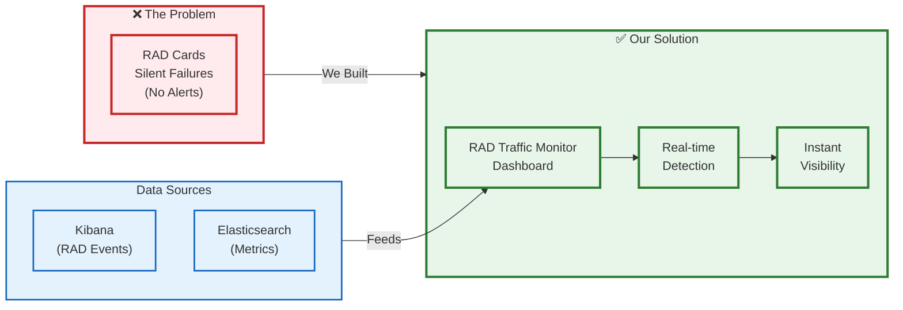
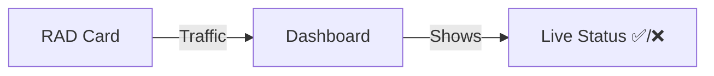
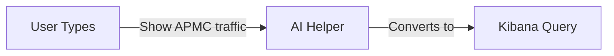
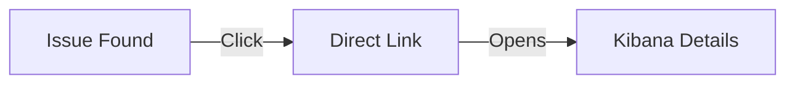

# RAD Traffic Monitor - Simple Architecture

## How It Works

## 3 Key Features

### 1️⃣ Real-Time Monitoring

### 2️⃣ Easy Query Builder

### 3️⃣ Direct Kibana Links

## Before vs After

| Before 😟 | After 😊 |
|-----------|----------|
| Silent failures | Real-time alerts |
| 1 week to detect | Instant detection |
| 18,500 → 0 impressions | Continuous monitoring |
| Complex Kibana syntax | Simple interface |

## Demo: [RAD Traffic Monitor](https://balkhalil-godaddy.github.io/vh-rad-traffic-monitor/)
