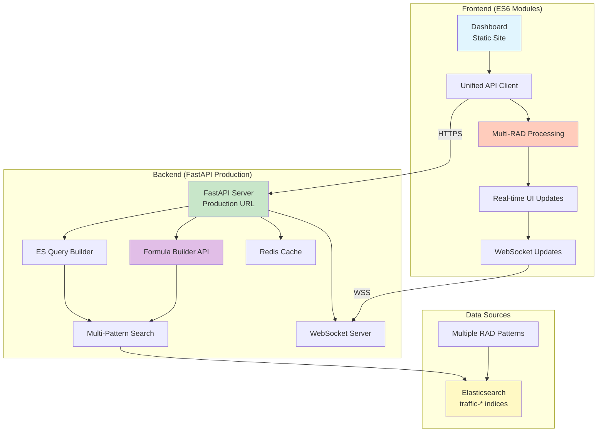
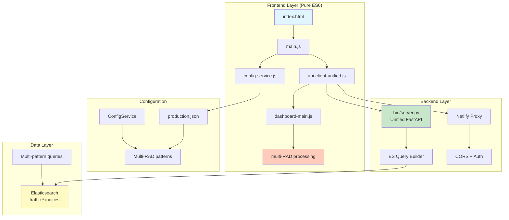

# RAD Monitor Dashboard

A real-time traffic monitoring dashboard for multiple RAD event types. Monitors venture feed, metrics, and recommendation systems with intelligent alerting for traffic anomalies.

## Live Dashboard

**Production URL**: https://balkhalil-godaddy.github.io/vh-rad-traffic-monitor/

> **Note**: Production deployment now uses FastAPI server for enhanced features including WebSocket support, formula builder, and better performance.

Just need to monitor traffic? Go to the URL above, enter your Kibana cookie when prompted, and you're good to go.

## Multi-RAD Support

The dashboard now monitors **multiple RAD event types** simultaneously:

- **🟢 Venture Feed** - `pandc.vnext.recommendations.feed.feed*` (Primary)
- **🟣 Venture Metrics** - `pandc.vnext.recommendations.metricsevolved*` (Active)
- **🔵 Cart Recommendations** - `pandc.vnext.recommendations.cart*` (Available)
- **🟠 Product Recommendations** - `pandc.vnext.recommendations.product*` (Available)

Filter by RAD type, compare performance across systems, and get unified alerts.

## How It Works



**Architecture**: Modern ES6 modules + Production FastAPI server + WebSocket support + Formula Builder + Redis caching.

## Getting Started

### For Monitoring (No Setup)

1. Go to https://balkhalil-godaddy.github.io/vh-rad-traffic-monitor/
2. When prompted, enter your Kibana cookie:
   - A clean modal will appear with instructions
   - Open Kibana in another tab
   - F12 → Network tab → Refresh page
   - Find any request → Copy the Cookie header value
   - Look for the `sid=Fe26.2**...` part
3. Paste cookie in the modal and click "Save Cookie"
4. Watch your traffic

### For Development

Clone and install:
```bash
git clone https://github.com/balkhalil-godaddy/vh-rad-traffic-monitor.git
cd vh-rad-traffic-monitor
npm install
```

#### First Time Setup (Python Environment)
```bash
# Create and activate Python virtual environment
python -m venv venv
source venv/bin/activate  # On Windows: venv\Scripts\activate

# Install Python dependencies
pip install -r requirements.txt
```

#### Environment Validation (NEW)

The server now validates all environment variables at startup:

✅ **Automatic validation** - Server won't start with missing configuration
✅ **Clear error messages** - Shows exactly what's missing with examples
✅ **Type safety** - Converts and validates all values
✅ **Production security** - Enforces stricter requirements in production

If configuration is missing, you'll see:
```
❌ Environment validation failed:
  - ELASTICSEARCH_URL: Required variable is not set. Elasticsearch endpoint URL
    Example: ELASTICSEARCH_URL=https://your-es-instance.aws.found.io:9243
```

See [Environment Validation Guide](docs/ENVIRONMENT_VALIDATION.md) for details.

#### Daily Development
```bash
# After initial setup, just run:
npm run dev

# This starts the unified FastAPI server at http://localhost:8000
# Includes: API endpoints + WebSocket + Static files + Multi-RAD support
```

**Quick Reference:**
- `npm run dev` = Starts unified server via `bin/server.py`
- `npm test` = Run test suite (requires ES6 migration completion)
- `npm run build` = Generate static production build

## Key Files & URLs

| Component | Location | Purpose |
|-----------|----------|---------|
| **Production Dashboard** | https://balkhalil-godaddy.github.io/vh-rad-traffic-monitor/ | Live monitoring interface |
| **CORS Proxy** | https://regal-youtiao-09c777.netlify.app/.netlify/functions/proxy | Handles auth + CORS |
| **Unified API Server** | `bin/server.py` | FastAPI server (dev: port 8000) |
| **Configuration** | `config/production.json` | Production settings |
| **API Client** | `assets/js/api-client-unified.js` | Single API interface |
| **Multi-RAD Config** | RAD types in ConfigService | Pattern definitions |

## Current Architecture (Post-Consolidation)



**Key Improvements:**
- (✓)**Unified Backend**: Single FastAPI server replaces multiple Python services
- (✓)**Pure ES6 Modules**: No more IIFE patterns or global pollution
- (✓)**Single API Client**: Consolidated from 3 different clients
- (✓)**Multi-RAD Support**: Monitor multiple recommendation systems
- (✓)**Simplified Architecture**: Fewer moving parts, easier maintenance

## Essential Commands

```bash
# Check if everything's configured right
./scripts/verify-config.sh

# Test the proxy
curl https://regal-youtiao-09c777.netlify.app/.netlify/functions/proxy

# Test authentication flow
open test-auth-flow.html    # Test auth system independently

# Redeploy proxy (if you change proxy.js)
cd proxy-service && npx netlify deploy --prod

# Run tests
npm test              # JavaScript tests
npm run test:all      # Everything

# Generate static dashboard (for GitHub Actions)
npm run generate
```

## Configuration

The important stuff lives in these files:

**`config/production.json`** - This gets deployed to GitHub Pages
```json
{
  "corsProxy": {
    "url": "https://regal-youtiao-09c777.netlify.app/.netlify/functions/proxy"
  },
  "elasticsearch": {
    "path": "/api/console/proxy?path=traffic-*/_search&method=POST"
  }
}
```

**Don't change these**:
- The proxy URL (unless you deploy a new one)
- The index pattern (`traffic-*`)
- The Kibana proxy path format

## Production Deployment

### New: FastAPI Server Deployment

The production system now uses a FastAPI server for enhanced features:

#### 1. Prepare Environment
```bash
# Copy and configure production environment
cp .env.production.example .env.production
# Edit .env.production with your values:
# - API_URL: Your production server URL
# - ELASTICSEARCH_URL: Your Elasticsearch endpoint
# - KIBANA_URL: Your Kibana endpoint
# - ALLOWED_ORIGINS: Comma-separated list of allowed domains
# - SECRET_KEY: Generate with: openssl rand -hex 32
```

#### 2. Deploy Server
```bash
# Run deployment script
./deploy-production.sh

# Options:
# For systemd service:
CREATE_SYSTEMD_SERVICE=true ./deploy-production.sh

# For Docker deployment:
DEPLOY_WITH_DOCKER=true ./deploy-production.sh
```

#### 3. Server Options

**Option A: Systemd Service (Linux)**
```bash
sudo systemctl start rad-monitor
sudo systemctl status rad-monitor
sudo journalctl -u rad-monitor -f
```

**Option B: Docker Compose**
```bash
docker-compose -f docker-compose.prod.yml up -d
docker-compose -f docker-compose.prod.yml logs -f
```

**Option C: Process Manager (PM2)**
```bash
pm2 start bin/server_production.py --name rad-monitor
pm2 logs rad-monitor
```

### GitHub Pages (Static Files)
Pushes to `main` automatically deploy the static files via GitHub Actions. The static site connects to your FastAPI server.

## Authentication

The dashboard needs a Kibana session cookie. The cookie:
- Expires after 24 hours (auto-cleared)
- Can be entered as `Fe26.2**...` or `sid=Fe26.2**...` (proxy handles both)
- Gets stored in localStorage with automatic expiry
- Shows a clean modal UI for entry (no browser prompts)
- Only prompts once per session (no authentication loops)

## Common Issues

**"Invalid cookie header"**
- Your cookie expired. Click "Set Cookie" button to enter a fresh one from Kibana.

**No data showing**
- Check the browser console
- Make sure you're looking at `traffic-*` indices
- Verify time range isn't too restrictive

**CORS errors**
- The proxy might be down. Test it with curl (see commands above)
- Redeploy the proxy if needed

**Wrong index pattern errors**
- Run `./scripts/verify-config.sh` to check configuration
- Make sure all configs use `traffic-*` not `usi*`

## Troubleshooting

### Common Errors

1. **Module syntax errors** (`Unexpected token 'export'`)
   - Fixed: Removed duplicate script loading in index.html

2. **API 404 errors** (`POST /api/v1/query 404`)
   - Fixed: Updated to correct endpoint `/api/v1/dashboard/query`

3. **Authentication issues**
   - The cookie modal now validates cookies before saving
   - Invalid cookies show error messages instead of loops

For more details, see [README_detailed.md](README_detailed.md#known-issues--solutions).

## What This Monitors

The dashboard tracks RAD events matching this pattern:
- `pandc.vnext.recommendations.feed.feed*`

It compares:
- Current period: Last 12 hours (configurable)
- Baseline: June 1-9, 2025 (8 days)

Status levels:
- 🔴 **CRITICAL**: Traffic dropped >80%
- 🟡 **WARNING**: Traffic dropped 50-80%
- 🟢 **NORMAL**: Traffic looks fine
- 🔵 **INCREASED**: Traffic is up

## Formula Builder

The dashboard includes a powerful formula builder for creating custom monitoring rules:

- **Visual Builder**: Drag-and-drop interface for non-technical users
- **Direct Editor**: Monaco-like editor with autocomplete for power users
- **Pre-built Templates**: Common monitoring patterns ready to use
- **AI Assistant**: Natural language formula generation with MCP integration

For documentation:
- **User Guide**: See [FORMULA_BUILDER_GUIDE.md](FORMULA_BUILDER_GUIDE.md) for how to use the formula builder
- **Technical Reference**: See [FORMULA_BUILDER_TECHNICAL_REFERENCE.md](FORMULA_BUILDER_TECHNICAL_REFERENCE.md) for API and development details

## MCP Integration (Model Context Protocol)

The project includes MCP servers for AI-powered interactions through Cursor:

### Available MCPs

1. **Formula Builder MCP** (`mcp-formula-builder/`)
   - Generate formulas from natural language
   - Validate and explain formulas
   - Convert to Elasticsearch queries

2. **Elasticsearch MCP** (`mcp-elasticsearch/`)
   - Execute queries on traffic indices
   - Monitor RAD traffic drops
   - Analyze root causes
   - Check index health

3. **Data Service MCP** (`mcp-data-service/`)
   - Fetch metrics with formulas
   - Analyze traffic patterns
   - Validate connections

### Quick Setup

```bash
# Install Formula Builder MCP
cd mcp-formula-builder
npm install

# Add to Cursor settings.json:
{
  "mcpServers": {
    "vh-rad-formula": {
      "command": "node",
      "args": ["${workspaceFolder}/mcp-formula-builder/index.js"]
    }
  }
}
```

Now you can ask Cursor:
- "Generate a formula to detect traffic drops"
- "Explain what this formula does: count() / count(shift='1d')"
- "Validate my formula syntax"

See [MCP_INTEGRATION_GUIDE.md](MCP_INTEGRATION_GUIDE.md) for complete setup and usage.

## Project Structure

```
.
├── index.html                    # The dashboard
├── assets/js/
│   ├── api-client-unified.js     # Handles API calls
│   └── config-service.js         # Loads configuration
├── config/
│   ├── production.json           # Production settings
│   └── settings.json             # Local settings
├── proxy-service/
│   └── netlify/functions/
│       └── proxy.js              # CORS proxy function
└── scripts/
    └── verify-config.sh          # Config checker
```

## Need Help?

1. Check the console for errors
2. Run `./scripts/verify-config.sh`
3. Test the proxy is alive
4. Make sure your cookie is fresh

That's it. Keep it simple. Monitor your traffic. Fix issues fast.
