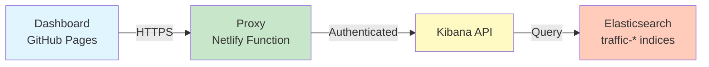
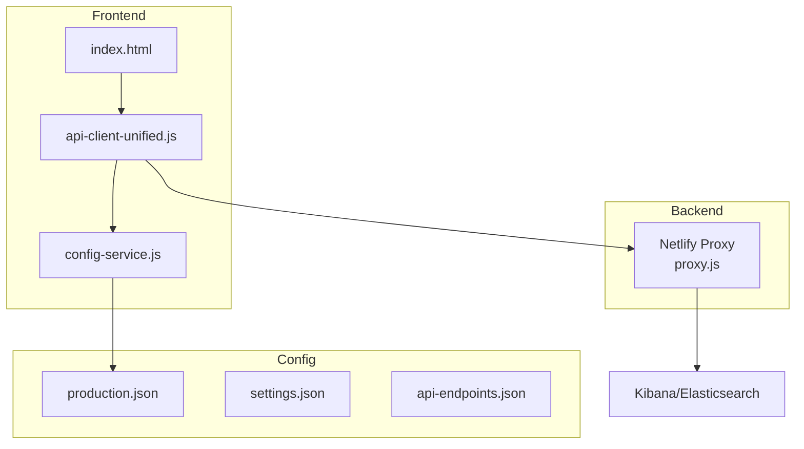

# RAD Monitor Dashboard

A real-time traffic monitoring dashboard for RAD (Recommendations and Discovery) events. Shows you when traffic drops so you can catch issues fast.

## Live Dashboard

**Production URL**: https://balkhalil-godaddy.github.io/vh-rad-traffic-monitor/

Just need to monitor traffic? Go to the URL above, enter your Kibana cookie when prompted, and you're good to go.

## How It Works



The dashboard queries Elasticsearch for RAD events, compares current traffic to historical baselines, and flags anything that looks wrong.

## Getting Started

### For Monitoring (No Setup)

1. Go to https://balkhalil-godaddy.github.io/vh-rad-traffic-monitor/
2. Get your Kibana cookie:
   - Open Kibana
   - F12 → Network tab → Refresh page
   - Find any request → Copy the Cookie header value
   - Look for the `sid=Fe26.2**...` part
3. Paste cookie in dashboard when prompted
4. Watch your traffic

### For Development

Clone and install:
```bash
git clone https://github.com/balkhalil-godaddy/vh-rad-traffic-monitor.git
cd vh-rad-traffic-monitor
npm install
pip install -r requirements-enhanced.txt
```

Run locally:
```bash
npm run dev  # Starts everything you need on http://localhost:8000
```

## Key Files & URLs

| What | Where | Why |
|------|-------|-----|
| Dashboard | https://balkhalil-godaddy.github.io/vh-rad-traffic-monitor/ | Live production dashboard |
| Proxy | https://regal-youtiao-09c777.netlify.app/.netlify/functions/proxy | Handles CORS and auth |
| Main Config | `config/production.json` | Controls proxy URL and index pattern |
| Proxy Code | `proxy-service/netlify/functions/proxy.js` | The magic that makes it work |

## Architecture



## Essential Commands

```bash
# Check if everything's configured right
./scripts/verify-config.sh

# Test the proxy
curl https://regal-youtiao-09c777.netlify.app/.netlify/functions/proxy

# Redeploy proxy (if you change proxy.js)
cd proxy-service && npx netlify deploy --prod

# Run tests
npm test              # JavaScript tests
npm run test:all      # Everything

# Generate static dashboard (for GitHub Actions)
npm run generate
```

## Configuration

The important stuff lives in these files:

**`config/production.json`** - This gets deployed to GitHub Pages
```json
{
  "corsProxy": {
    "url": "https://regal-youtiao-09c777.netlify.app/.netlify/functions/proxy"
  },
  "elasticsearch": {
    "path": "/api/console/proxy?path=traffic-*/_search&method=POST"
  }
}
```

**Don't change these**:
- The proxy URL (unless you deploy a new one)
- The index pattern (`traffic-*`)
- The Kibana proxy path format

## Deployment

### GitHub Pages (Dashboard)
Pushes to `main` automatically deploy via GitHub Actions. Takes about 2-3 minutes.

### Netlify (Proxy)
The proxy function is deployed to Netlify. To update it:
```bash
cd proxy-service
npx netlify deploy --prod
```

## Authentication

The dashboard needs a Kibana session cookie. The cookie:
- Expires after 24 hours
- Can be entered as `Fe26.2**...` or `sid=Fe26.2**...` (proxy handles both)
- Gets stored in localStorage

## Common Issues

**"Invalid cookie header"**
- Your cookie expired. Get a fresh one from Kibana.

**No data showing**
- Check the browser console
- Make sure you're looking at `traffic-*` indices
- Verify time range isn't too restrictive

**CORS errors**
- The proxy might be down. Test it with curl (see commands above)
- Redeploy the proxy if needed

**Wrong index pattern errors**
- Run `./scripts/verify-config.sh` to check configuration
- Make sure all configs use `traffic-*` not `usi*`

## What This Monitors

The dashboard tracks RAD events matching this pattern:
- `pandc.vnext.recommendations.feed.feed*`

It compares:
- Current period: Last 12 hours (configurable)
- Baseline: June 1-9, 2025 (8 days)

Status levels:
- 🔴 **CRITICAL**: Traffic dropped >80%
- 🟡 **WARNING**: Traffic dropped 50-80%
- 🟢 **NORMAL**: Traffic looks fine
- 🔵 **INCREASED**: Traffic is up

## WAM General ET Monitoring

### Overview
The WAM (Web Analytics Module) implementation provides real-time visitor tracking using HyperLogLog++ cardinality estimation. It's integrated into the dashboard for monitoring EID-level traffic patterns.

### Quick Start
```bash
# Start the local WAM visualizer
./start-wam.sh

# Open in browser
http://localhost:8000/wam-visualizer.html
```

### Features
- **Real-time EID monitoring** with configurable time ranges (1h to 30d)
- **Baseline comparison** showing historical patterns with percentile ranges
- **Smooth transitions** between time periods
- **Dark mode** with automatic theme detection
- **Configurable settings** for all parameters via UI

### Architecture
```
wam-visualizer.html          # Main interface
├── wam-visualizer/
│   ├── wam-service.js      # Data fetching & baseline calculation
│   └── wam-chart.js        # Chart.js visualization component
└── server/
    └── elasticsearch-proxy.mjs  # Local proxy with auth validation
```

### Configuration
All settings accessible via the Configure button:
- API endpoints and proxy URL
- EID patterns and field mappings
- Visualization parameters (smoothness, point size, etc.)
- Baseline calculation weeks

### Key Improvements
- Fixed calendar_interval vs fixed_interval for different time ranges
- Baseline now properly aligns with current data intervals
- Removed unique visitors line for cleaner visualization
- Production-ready proxy with comprehensive error handling

## Project Structure

```
.
├── index.html                    # The dashboard
├── assets/js/
│   ├── api-client-unified.js     # Handles API calls
│   └── config-service.js         # Loads configuration
├── config/
│   ├── production.json           # Production settings
│   ├── settings.json             # Local settings
│   └── local-dev.json            # Local WAM development
├── proxy-service/
│   └── netlify/functions/
│       └── proxy.js              # CORS proxy function
├── wam-visualizer.html           # WAM monitoring interface
├── wam-visualizer/
│   ├── wam-service.js            # Data service for WAM
│   └── wam-chart.js              # Chart visualization
├── server/
│   └── elasticsearch-proxy.mjs   # Local proxy server
├── scripts/
│   └── verify-config.sh          # Config checker
├── start-wam.sh                  # Start WAM visualizer
└── stop-wam.sh                   # Stop WAM services
```

## Need Help?

1. Check the console for errors
2. Run `./scripts/verify-config.sh`
3. Test the proxy is alive
4. Make sure your cookie is fresh

That's it. Keep it simple. Monitor your traffic. Fix issues fast.
