# RAD Traffic Health Monitor

Real-time monitoring dashboard for RAD cards traffic health. Automatically detects and alerts on traffic anomalies across all RAD cards.

## Overview

This dashboard monitors impression and click traffic for RAD cards, comparing current performance against historical baselines to identify issues quickly. It provides:

- **Real-time monitoring** with live data updates
- **Automatic anomaly detection** using statistical analysis
- **Visual status indicators** (Critical/Warning/Normal/Increased)
- **Detailed metrics** including score, percentage change, and impact
- **GitHub Pages hosting** with automatic updates every 45 minutes

## 🆕 New: Unified Development Server

**One command to rule them all!** The RAD Monitor now features an intelligent development server that automatically chooses the best mode for your environment:

```bash
npm run dev    # Just works - auto-detects FastAPI or falls back to simple mode
```

No more confusion about which development command to use. The unified server provides:
- **🧠 Smart detection** of your environment capabilities
- **🚀 Automatic setup** of FastAPI features when available
- **⚡ Fast fallback** to simple mode when needed
- **🛡️ Zero failures** - always gives you a working development server

[→ See Unified Development Server section for details](#unified-development-server)

## Key Features

### Live Data Functionality
- **Real-time API calls** to Elasticsearch/Kibana
- **CORS proxy support** for local development
- **Automatic refresh** with configurable intervals
- **Cookie-based authentication** for secure access
- **🎯 Console Dashboard** - ASCII bar charts in browser console for every data fetch!
- **🎯 Console Dashboard** - ASCII bar charts in browser console for every data fetch!

### Performance Monitoring & Health Tracking
- **Real-time performance metrics** tracking every query and API call
- **CORS proxy health monitoring** with visual indicators (🟢/🔴)
- **Intelligent auto-refresh** that adapts based on performance
- **Cache optimization** with hit rate tracking
- **Performance warnings** for slow queries (>3s API, >5s DataLayer)
- **Console command**: `Dashboard.showPerformanceStats()` for detailed metrics
- **Health status API**: `Dashboard.getHealthStatus()` for overall system health

### Intelligent Scoring System
- **Statistical analysis** combining percentage change and z-score
- **Volume-weighted scoring** to prioritize high-traffic cards
- **Customizable thresholds** for alerts
- **Historical baseline comparison** (8-day average)

### Dashboard Controls
The dashboard features a **permanently visible control panel** on the left side providing instant access to:
- **Critical/Warning thresholds**: Customize alert sensitivity
- **Minimum volume filter**: Hide low-traffic cards
- **Time range**: Select from 1 hour to 48 hours of data
- **Auto-refresh**: Toggle and configure refresh interval
- **Apply/Reset**: Instantly update dashboard with new settings

> **Design Note**: The control panel is always visible by design - users prefer having immediate access to all controls without needing to toggle a panel.

### State Management & Redux-Style Logging
The dashboard uses a centralized DataLayer state management system with comprehensive Redux-style action logging:

```javascript
// Every state action is logged with:
action DASHBOARD_REFRESH_START @ 23:24:09.821
prev state {activeQueries: {…}, responseCache: {…}, parsedCache: {…}}
action     {type: 'DASHBOARD_REFRESH_START', refreshId: 'refresh_1234', timestamp: '...'}
next state {activeQueries: {size: 1}, responseCache: {…}, parsedCache: {…}}
```

#### Control State Logging:
```javascript
// Enable/disable logging
DataLayer.configureLogging({ enabled: true, collapsed: false });

// Custom action logging
DataLayer.logAction('MY_ACTION', { data: 'custom' });
```

This provides complete visibility into data flow and makes debugging much easier.

### Automated Deployment
- **GitHub Actions** updates dashboard every 45 minutes
- **GitHub Pages hosting** for production deployment
- **Automatic error recovery** and retry logic
- **No server required** - runs entirely in the browser

### NPM Commands
All common tasks can be run via npm:

| Command | Description |
|---------|-------------|
| `npm run dev` | **🎯 Smart development server** - Auto-detects best mode (FastAPI or Simple) |
| `npm run dev:simple` | **Fast startup** - Simple HTTP server + CORS proxy |
| `npm run dev:fastapi` | **Full features** - FastAPI server with WebSocket, API docs, validation |
| `npm run dev:setup` | **First-time setup** - Install FastAPI dependencies and run |
| `npm run cors-proxy` | Start only the CORS proxy server (port 8889) |
| `npm run serve` | Start only the web server (port 8000) |
| `npm run generate` | Generate dashboard with latest data |
| `npm test` | Run JavaScript tests in watch mode |
| `npm run test:run` | Run JavaScript tests once |
| `npm run test:coverage` | Run tests with coverage report |
| `npm run test:python` | Run Python tests |
| `npm run test:bash` | Run Bash tests (requires bats) |
| `npm run test:all` | Run complete test suite (JS, Python, Bash) |

## Quick Start

### Prerequisites
- Node.js and npm
- Python 3.x
- Git
- Web browser
- Elasticsearch/Kibana access with valid cookie
- bats (optional, for bash tests): `brew install bats-core` (macOS) or `apt-get install bats` (Linux)

### Local Development with Live Data

1. **Clone the repository**
   ```bash
   git clone https://github.com/yourusername/rad_monitor.git
   cd rad_monitor
   ```

2. **Set up authentication**
   ```bash
   # Get your Elastic cookie from Kibana (see Authentication section)
   export ELASTIC_COOKIE="your_cookie_here"
   ```

3. **Install dependencies**
   ```bash
   npm install
   ```

4. **Start development server** (one command that just works!)

   **🎯 Recommended: Unified Smart Server**
   ```bash
   npm run dev
   ```
   This intelligent command will:
   - **Auto-detect** if FastAPI is available and use it for full features
   - **Graceful fallback** to simple mode if FastAPI isn't set up
   - **Clean startup** with clear instructions on which URL to open
   - **Port management** - automatically cleans up conflicting processes
   - **Show** exactly what mode it's running in

   **🚀 First-time FastAPI Setup**
   ```bash
   npm run dev:setup
   ```
   Perfect for first-time setup or when you want full FastAPI features:
   - **Automatic environment setup** - creates venv and installs dependencies
   - **Full feature set** - WebSocket, API endpoints, validation, caching
   - **Interactive API docs** at http://localhost:8000/docs
   - **Real-time updates** via WebSocket at `ws://localhost:8000/ws`

   **⚡ Quick Frontend Testing**
   ```bash
   npm run dev:simple
   ```
   Use when you need fast startup for frontend-only work:
   - **Instant startup** - no dependency installation
   - **Basic features** - HTTP server + CORS proxy
   - **Perfect for** UI testing and quick iterations

   **Advanced Options**
   ```bash
   # Force FastAPI mode (will show error if not available)
   npm run dev:fastapi

   # Direct Python usage with options
   python3 dev_server_unified.py --help
   python3 dev_server_unified.py --mode simple
   python3 dev_server_unified.py --setup
   ```

### Alternative Commands

```bash
# Quick test - generate static dashboard
./test_locally.sh

# Start only CORS proxy (port 8889)
npm run cors-proxy

# Start only web server (port 8000)
npm run serve

# Generate dashboard without starting servers
npm run generate
# or: python3 generate_dashboard.py

# Run all tests
npm run test:all
```

## Unified Development Server

The RAD Monitor now features an **intelligent unified development server** that automatically chooses the best mode for your environment. This eliminates the confusion of multiple development commands and provides a seamless experience.

### 🎯 How It Works

```mermaid
graph TD
    A["npm run dev"] --> B{FastAPI Available?}
    B -->|Yes| C[FastAPI Mode<br/>Full Features]
    B -->|No| D{Can Setup FastAPI?}
    D -->|Yes| E[Offer Auto-Setup<br/>npm run dev:setup]
    D -->|No| F[Simple Mode<br/>Always Works]
    E --> C

    C --> G[✅ WebSocket Updates<br/>✅ API Endpoints<br/>✅ Validation<br/>✅ Interactive Docs]
    F --> H[✅ Fast Startup<br/>✅ Basic Features<br/>✅ CORS Proxy]
```



### 🚀 Development Modes

| Mode | Startup Time | Features | Best For |
|------|-------------|----------|----------|
| **Smart (auto)** | Variable | Best available | Daily development |
| **FastAPI** | ~3-5 seconds | Full feature set | Full-stack work |
| **Simple** | Instant | HTTP + CORS | Frontend testing |

### 💡 Key Benefits

- **🧠 Intelligent**: One command that adapts to your environment
- **🛡️ Reliable**: Graceful fallbacks prevent development blocks
- **⚡ Fast**: Optimized startup for your specific needs
- **🔧 Flexible**: Override options when you need specific behavior
- **🎯 Simple**: No more confusion about which command to use

### Development Workflow Examples

```bash
# Morning standup - just get started quickly
npm run dev

# Working on API integration - need full features
npm run dev:setup

# Quick CSS fix - want instant startup
npm run dev:simple

# Testing WebSocket features - force FastAPI mode
npm run dev:fastapi
```

## Dependencies

### NPM Dependencies (JavaScript)

All dependencies are installed with `npm install`:

| Package | Version | Purpose |
|---------|---------|---------|
| **vitest** | ^1.2.1 | Primary test runner for JavaScript tests |
| **@vitest/coverage-v8** | ^1.2.1 | Code coverage reporting for tests |
| **jsdom** | ^24.0.0 | DOM environment for testing (simulates browser) |
| **concurrently** | ^8.2.2 | Runs multiple processes (CORS proxy + web server) |

### Python Dependencies

**Runtime (built-in modules only):**
- Python 3.x standard library
- No external packages required for running the dashboard

**Enhanced Proxy (optional):**
Install with: `pip install -r requirements-enhanced.txt`
- **FastAPI** (0.104.0+) - Modern web framework for building APIs
- **Pydantic v2** (2.5.0+) - Data validation using Python type annotations
- **Uvicorn** (0.24.0+) - ASGI server for FastAPI
- **python-dateutil** (2.8.2+) - Date/time parsing utilities

**Testing (optional):**
Install with: `pip install -r tests/requirements.txt`
- pytest (8.3.2) - Test runner
- pytest-cov (5.0.0) - Coverage reporting
- pytest-mock (3.14.0) - Mocking utilities
- pytest-asyncio (0.23.8) - Async test support
- requests (2.32.3) - HTTP client for tests
- responses (0.25.3) - HTTP mocking

### External Tools

| Tool | Required For | Installation |
|------|--------------|--------------|
| **Python 3.x** | Core functionality | Pre-installed on most systems |
| **bats** | Bash tests only | `brew install bats-core` (macOS)<br>`apt-get install bats` (Linux) |

### Port Configuration

| Service | Port | Purpose |
|---------|------|---------|
| **CORS Proxy** | 8889 | Proxies Kibana API requests with CORS headers |
| **Web Server** | 8000 | Serves the dashboard HTML/JS/CSS |

**Note**: If you see "Address already in use" errors, ensure no other processes are using these ports:
```bash
# Check what's using the ports
lsof -i :8889 -i :8000

# Kill processes if needed
kill -9 <PID>
```

## Authentication

The dashboard requires an Elasticsearch session cookie to fetch data.

### How to get your Elastic cookie:
1. Open Kibana (your Elasticsearch dashboard)
2. Open browser Developer Tools → Network tab
3. Find any request to Kibana
4. Look for `Cookie: sid=...` in request headers
5. Copy the entire sid value

**GitHub Actions (for automated updates):**
1. Go to your repo's Settings → Secrets and variables → Actions
2. Add new secret named `ELASTIC_COOKIE`
3. Paste your sid value

### Setting the Cookie:

**For local development:**
```bash
export ELASTIC_COOKIE="Fe26.2**your_cookie_here**"
```

**For GitHub deployment:**
1. Go to your repo's Settings → Secrets and variables → Actions
2. Add a new secret named `ELASTIC_COOKIE`
3. Paste your cookie value

**In the dashboard UI:**
1. Click the gear icon
2. Click "Set Cookie for Real-time"
3. Paste your Elastic cookie
4. Click "Test Connection" to verify

## GitHub Pages Deployment

The dashboard is automatically deployed to GitHub Pages:

1. **Automatic Updates**: GitHub Actions runs every 45 minutes
2. **URL**: `https://{username}.github.io/{repo-name}/`
3. **Live Data**: Works without CORS proxy on GitHub Pages
4. **Fallback**: Shows static data when real-time is unavailable

### Manual Deployment

```bash
# Generate dashboard
python3 generate_dashboard.py
# or use the wrapper: ./scripts/generate_dashboard_refactored.sh

# Commit and push
git add index.html data/
git commit -m "Update dashboard"
git push
```

## Configuration

### Dashboard Settings

Use the Control Panel (gear icon) for real-time configuration:

- **Critical Threshold**: Percentage drop for critical alerts (-80% default)
- **Warning Threshold**: Percentage drop for warnings (-50% default)
- **Min Daily Volume**: Filter out low-traffic cards (100 default)
- **Time Range**: Data window from 1h to 48h (12h default) or custom time ranges
- **Auto Refresh**: Toggle and set interval (60s default)

### Custom Time Ranges

The dashboard now supports custom time ranges for analyzing specific time periods in the past:

**Standard Formats (existing):**
- `now-6h` - Last 6 hours from now
- `now-12h` - Last 12 hours from now (default)
- `now-24h` - Last 24 hours from now
- `now-3d` - Last 3 days from now

**New Custom Formats:**
- `-3h-6h` - From 3 hours ago TO 6 hours ago (3-hour window)
- `-1h-4h` - From 1 hour ago TO 4 hours ago (3-hour window)
- `-2h-8h` - From 2 hours ago TO 8 hours ago (6-hour window)
- `-2h-1d` - From 2 hours ago TO 1 day ago (22-hour window)
- `-1d-2d` - Yesterday TO day before yesterday (24-hour window)

**Special Time Range:**
- `inspection_time` - A predefined 16-hour inspection window (from 24h ago to 8h ago)
  - Perfect for post-incident analysis
  - Useful for scheduled maintenance reviews
  - Avoids recent data that might still be processing

**Real-World Examples:**
- **Incident Analysis**: `-2h-5h` - Analyze a 3-hour incident window
- **Maintenance Window**: `-4h-6h` - Review 2-hour maintenance period
- **Compare Time Periods**: `-168h-180h` - Same time last week (12-hour window)
- **After-hours Traffic**: `-12h-24h` - Yesterday's afternoon vs today's afternoon

**How to Use:**
1. In the dashboard control panel, enter a custom time range like `-3h-6h`
2. Click "APPLY CONFIGURATION" or "REFRESH NOW"
3. The dashboard will show traffic data for that specific time window

### Console Dashboard (Hack Mode!)

The dashboard includes an **ASCII visualization** that appears in your browser console every time data is fetched!

**Features:**
- **Live ASCII bar charts** showing Current vs Assumed traffic
- **Status indicators** (CRIT, WARN, NORM, HIGH)
- **Time window info** displays exactly what data range you're viewing
- **Active filters** shows search terms and filters applied
- **Summary statistics** with counts
- **Performance metrics** showing query time, cache rate, reliability
- **CORS proxy status** for localhost development

**How to Access:**
1. Open your browser Developer Tools (F12)
2. Go to the Console tab
3. Load the dashboard - you'll see a welcome message
4. Every time you refresh or change settings, new bar charts appear!

**Example Console Output:**
```
RAD MONITOR - CONSOLE DASHBOARD
===============================================================================
TIME WINDOW: 6/18/2025, 12:00:00 PM -> 6/18/2025, 3:00:00 PM (3h)
-------------------------------------------------------------------------------
TRAFFIC VISUALIZATION (Current vs Assumed)

[CRIT] feed_apmc                   -90%
   Current  ███░░░░░░░░░░░░░░░░░░░░░░░░░░░ 100
   Assumed  ██████████████████████████████ 1,000

[NORM] feed_marketing               -4%
   Current  ██████████████░░░░░░░░░░░░░░░░ 480
   Assumed  ███████████████░░░░░░░░░░░░░░░ 500

-------------------------------------------------------------------------------
SUMMARY: 1 Critical | 0 Warning | 1 Normal | 0 Increased
FETCH TIME: 6/18/2025, 6:26:34 PM
===============================================================================
```

**Perfect for:**
- **Debugging** - See exactly what data is being fetched
- **Monitoring** - Keep console open while doing other work
- **Analysis** - Quick visual comparison of time periods
- **Hack Vibes** - Because ASCII art in production is awesome!

### Performance Monitoring Dashboard

The dashboard includes comprehensive performance monitoring that tracks every operation:

**Performance Widget:**
A real-time performance widget displays key metrics directly on the dashboard:
- **Average Query Time** - Color-coded (green <1s, yellow <3s, red >3s)
- **Cache Hit Rate** - Shows efficiency of caching (target: >70%)
- **Failed Queries** - Count of failed operations
- **Reliability** - Overall system reliability percentage

**Console Commands:**
```javascript
// View detailed performance statistics
Dashboard.showPerformanceStats()

// Get system health status with score
Dashboard.getHealthStatus()

// Access raw performance metrics
DataLayer.getPerformanceMetrics()

// Reset performance metrics
DataLayer.resetPerformanceMetrics()
```

**Tracked Metrics:**
- Query duration for every API call and DataLayer operation
- Cache hit/miss rates for optimizing performance
- Authentication resolution times
- Data processing performance (with 100ms warning threshold)
- CORS proxy health status (localhost only)
- Configuration change impacts on performance

**Intelligent Behaviors:**
- **Auto-refresh skipping** when average query time exceeds 10 seconds
- **Performance warnings** logged for slow operations
- **Adaptive thresholds** based on operation type
- **Historical tracking** with rolling averages and hourly maximums

**Performance Thresholds:**
| Operation | Warning Threshold | Critical Threshold |
|-----------|------------------|-------------------|
| API Calls | 3 seconds | 5 seconds |
| DataLayer Queries | 5 seconds | 10 seconds |
| Data Processing | 100ms | 500ms |
| Cache Hit Rate | <70% | <50% |
| Reliability | <90% | <80% |

**CORS Proxy Monitoring (localhost):**
- Health checks every 60 seconds
- Visual indicator next to dashboard title
- Warning banner when proxy is down
- Automatic status updates in performance metrics

### CORS Proxy Settings

In `cors_proxy.py`:
```python
port = 8889  # Proxy port (line 133)
KIBANA_URL = "https://usieventho-prod-usw2.kb.us-west-2.aws.found.io:9243"
```

### GitHub Actions Schedule

In `.github/workflows/update-dashboard.yml`:
```yaml
schedule:
  - cron: '*/45 * * * *'  # Every 45 minutes
```

## How It Works

### Score Calculation

The dashboard uses a sophisticated scoring system:

```javascript
// Percentage change from baseline
const percentChange = ((current - baseline) / baseline) * 100;

// Status determination based on thresholds
if (percentChange <= criticalThreshold) status = 'CRITICAL';
else if (percentChange <= warningThreshold) status = 'WARNING';
else if (percentChange <= 0) status = 'NORMAL';
else status = 'INCREASED';
```

### Data Flow

```
Elasticsearch/Kibana API
        ↓
[Local: CORS Proxy / Production: Direct API]
        ↓
Dashboard JavaScript
        ↓
Visual Display (HTML/CSS)
        ↓
Automatic Updates (GitHub Actions)
```

### Live Updates
- **Local Development**: Uses CORS proxy for API calls
- **GitHub Pages**: Direct API calls with credentials
- **Fallback**: Static data embedded in HTML

## Project Structure

```
rad_monitor/
├── index.html                   # Main dashboard with live functionality
├── generate_dashboard.py        # Python dashboard generator (main script)
├── scripts/
│   ├── generate_dashboard.sh    # Original monolithic script (deprecated)
│   ├── generate_dashboard_refactored.sh  # Wrapper for Python version
│   └── lib/                     # Utility functions
├── config/                      # Configuration files
│   ├── dashboard.config.sh      # Environment variables
│   └── queries/                 # Elasticsearch queries
├── src/                         # Source code
│   └── data/                    # Data processing
│       ├── process_data.py      # Python orchestrator
│       └── processors/          # Processing modules
├── assets/                      # Frontend assets
│   ├── css/                     # Stylesheets
│   ├── js/                      # JavaScript modules
│   │   ├── api-client.js        # API client with DataLayer integration
│   │   ├── data-layer.js        # State management system
│   │   ├── state-logging-demo.js # Redux-style logging demo
│   │   └── ...                  # Other modules
│   └── templates/               # HTML templates
├── tests/                       # Comprehensive test suite
│   ├── *.test.js               # JavaScript tests (Vitest)
│   ├── test_*.py               # Python tests (pytest)
│   ├── test_*.bats             # Bash tests (bats)
│   └── requirements.txt        # Test dependencies
├── data/
│   └── raw_response.json       # Latest API response (generated)
├── .github/
│   └── workflows/
│       ├── update-dashboard.yml # Auto-update workflow (every 45 min)
│       ├── test.yml            # CI test workflow
│       └── test-comprehensive.yml # Full test suite
├── cors_proxy.py               # Local CORS proxy server
├── dev_server_unified.py      # Unified development server with auto-detection
├── run_with_cors.sh           # Primary local development script
├── test_locally.sh            # Quick test script
├── run_all_tests.sh           # Comprehensive test runner
├── package.json               # Node.js dependencies
├── vitest.config.js           # JavaScript test configuration
├── .gitignore                 # Git ignore patterns
├── .nojekyll                  # Disable Jekyll for GitHub Pages
├── docs/                          # All documentation files
│   ├── Architecture & Design
│   ├── Migration Guides
│   ├── Feature Documentation
│   └── Development Guides
├── requirements-enhanced.txt       # Dependencies for enhanced proxy
├── run_enhanced_cors.sh           # Run enhanced CORS proxy
├── dev_server_fastapi.py          # FastAPI development server with WebSocket
├── run_fastapi_dev.sh            # Run FastAPI development server
└── README.md                  # This file
```

## Architecture & Test Coverage

<details>
<summary>📊 <b>View Application Architecture Diagram</b> (Click to expand)</summary>


</details>

### Module Overview

The application follows a modular architecture with clear separation of concerns:

- **Frontend Components**: Handle UI rendering and user interactions
- **Data Processing Layer**: Core business logic for score calculation and status determination
- **API & Network Layer**: Manages all external communications
- **Configuration & State**: Centralized state management and configuration
- **Business Logic**: High-level orchestration and integration
- **Compatibility Layer**: Bridges old test expectations with new modular structure

## FastAPI Development Server

The project now includes a FastAPI-based development server that provides enhanced capabilities over the standard Python HTTP server.

### Key Features

**1. REST API with Validation**
- **GET /api/config** - Retrieve current dashboard configuration
- **POST /api/config** - Update configuration with Pydantic validation
- **GET /api/stats** - Get current dashboard statistics
- **POST /api/refresh** - Refresh dashboard data with new configuration
- **POST /api/fetch-kibana-data** - Execute Elasticsearch queries with caching and performance tracking (NEW!)
- **GET /health** - Server health check with system status

**2. WebSocket Support**
- Real-time bidirectional communication at `ws://localhost:8000/ws`
- Automatic broadcasting of configuration changes to all connected clients
- Ping/pong heartbeat mechanism for connection health
- Reconnection logic with exponential backoff

**3. Request/Response Validation**
All API endpoints use Pydantic v2 models for validation:

```python
class DashboardConfig(BaseModel):
    baseline_start: str = Field(..., pattern=r'^\d{4}-\d{2}-\d{2}$')
    baseline_end: str = Field(..., pattern=r'^\d{4}-\d{2}-\d{2}$')
    time_range: str = "now-12h"
    critical_threshold: int = Field(default=-80, le=0)
    warning_threshold: int = Field(default=-50, le=0)
    high_volume_threshold: int = Field(default=1000, ge=1)
    medium_volume_threshold: int = Field(default=100, ge=1)
```

**4. Auto-Generated Documentation**
- Interactive API documentation at http://localhost:8000/docs
- OpenAPI schema at http://localhost:8000/openapi.json
- Try out endpoints directly from the browser

**5. JavaScript Client Library**
A comprehensive client library (`api-client-fastapi.js`) provides:
- WebSocket connection management with auto-reconnect
- Typed API methods for all endpoints
- Configuration validation helpers
- Event-based architecture for real-time updates

### New Kibana Data Endpoint

The `/api/fetch-kibana-data` endpoint replaces the functionality of the old bash script with a modern, typed FastAPI endpoint. The data fetching is now handled by `generate_dashboard.py` which automatically tries the FastAPI endpoint first, then falls back to the CORS proxy if needed:

**Features:**
- **Type-safe queries** with Pydantic validation (requires `events` aggregation)
- **Built-in caching** with MD5-based cache keys (5-minute TTL)
- **Performance tracking** with WebSocket broadcasts for real-time monitoring
- **Comprehensive error handling** for auth failures, timeouts, and ES errors
- **Automatic performance warnings** for slow queries (>3s warning, >5s critical)

**Request Format:**
```javascript
const response = await FastAPIClient.fetchKibanaData({
  size: 0,
  query: {
    bool: {
      filter: [
        { wildcard: { "detail.event.data.traffic.eid.keyword": { value: "pandc.vnext.*" } } },
        { range: { "@timestamp": { gte: "now-12h" } } }
      ]
    }
  },
  aggs: {
    events: {  // Required aggregation
      terms: { field: "detail.event.data.traffic.eid.keyword", size: 500 }
    }
  }
}, forceRefresh = false);
```

**Performance Metrics Broadcast:**
```javascript
// Listen for performance updates
FastAPIClient.on('performance_metrics', (metrics) => {
  console.log(`Query ${metrics.query_id} took ${metrics.duration_ms}ms`);
  if (metrics.is_slow) {
    console.warn('Slow query detected!');
  }
});
```

**Authentication:**
The endpoint requires the Elastic cookie via `X-Elastic-Cookie` header. The client automatically:
1. Checks localStorage for `elastic_cookie`
2. Checks document cookies for `sid`
3. Falls back to `window.ELASTIC_COOKIE`

### Usage Example

```javascript
// Initialize the FastAPI client
await FastAPIClient.initialize();

// Listen for real-time updates
FastAPIClient.on('config', (newConfig) => {
    console.log('Configuration updated:', newConfig);
});

FastAPIClient.on('stats', (newStats) => {
    console.log('Statistics updated:', newStats);
});

// Update configuration
const newConfig = FastAPIClient.buildConfig({
    baseline_start: '2025-07-01',
    time_range: 'now-24h',
    critical_threshold: -90
});

// Validate before sending
const errors = FastAPIClient.validateConfig(newConfig);
if (errors.length === 0) {
    await FastAPIClient.updateConfig(newConfig);
}

// Refresh dashboard
await FastAPIClient.refreshDashboard(newConfig, true);
```

### Testing

The FastAPI server includes comprehensive test coverage:

```bash
# Run Python tests for FastAPI server
python -m pytest tests/test_dev_server_fastapi.py -v

# Run JavaScript tests for client library
npm test tests/fastapiClient.test.js
```

### Benefits Over Standard Server

1. **Type Safety**: Full request/response validation prevents runtime errors
2. **Real-time Updates**: WebSocket support enables instant UI updates
3. **Better Error Handling**: Detailed validation errors with helpful messages
4. **API Documentation**: Auto-generated, interactive API docs
5. **Performance**: Async request handling for better concurrency
6. **Developer Experience**: Modern tooling with hot reload support

## Installation

### Full Setup

1. **Install dependencies**
   ```bash
   # Install Node.js dependencies (required)
   npm install

   # For Python tests (optional)
   pip install -r tests/requirements.txt

   # For Bash tests (optional)
   brew install bats-core  # macOS
   sudo apt-get install bats  # Linux
   ```

2. **Configure GitHub Actions**
   - Add `ELASTIC_COOKIE` secret to your repository
   - Enable GitHub Pages from Settings → Pages
   - Select "Deploy from a branch" → main → / (root)

3. **Test locally**
   ```bash
   ./run_with_cors.sh
   ```

## Troubleshooting

### Common Issues

**502 Bad Gateway / Authentication Error:**
- Cookie has expired
- Get a fresh cookie from Kibana
- Update locally: `export ELASTIC_COOKIE="new_cookie"`
- Update GitHub Secret for automated updates

**CORS Errors (local only):**
- Use the unified development server: `npm run dev`
- Or start CORS proxy manually: `npm run cors-proxy`
- Check proxy is running on port 8889

**"Address already in use" error:**
- The unified development server automatically cleans up ports
- If issues persist, run: `npm run cleanup`
- Or manually check: `lsof -i :8889 -i :8000`
- Kill existing processes: `kill -9 <PID>`

**No Real-time Updates:**
- Click gear icon → "Set Cookie for Real-time"
- Test connection with "Test API Connection"
- Check browser console for errors

**Dashboard Not Updating on GitHub:**
- Check Actions tab for workflow runs
- Verify ELASTIC_COOKIE secret is set
- Check workflow logs for errors

**Development Server Issues:**
- **FastAPI setup fails**: Run `npm run dev:simple` for basic functionality
- **Auto-detection not working**: Use `python3 dev_server_unified.py --help` for options
- **Want to force a specific mode**: Use `npm run dev:fastapi` or `npm run dev:simple`
- **First time setup**: Use `npm run dev:setup` to install FastAPI dependencies

### Debug Commands

```bash
# Test CORS proxy
curl http://localhost:8889/health

# Check if cookie is valid
python3 generate_dashboard.py

# View recent GitHub Actions logs
gh run list --workflow=update-dashboard.yml

# Test all components
./run_all_tests.sh
```

## Testing

The project includes comprehensive test coverage with unit, integration, and end-to-end tests:

### JavaScript Tests (Vitest)
- **160+ tests** covering dashboard functionality
- **Real-time features**: Cookie handling, API calls, UI updates
- **Data processing**: Scoring, filtering, sorting algorithms
- **User interactions**: Control panel, authentication, search

Run with:
```bash
npm test              # Watch mode (development)
npm run test:run      # Single run
npm run test:coverage # With coverage report
```

### Python Tests (pytest)
- **60+ tests** including unit and integration tests
- **Unit tests**: CORS proxy, data models, processors, API endpoints
- **Integration tests**: Dashboard generation, full system flow, GitHub Pages
- **Component tests**: Kibana endpoint, Config API, FastAPI server

Run with:
```bash
cd tests && python -m pytest --cov=.. test_*.py      # All Python tests
python3 tests/test_dashboard_generation.py            # Dashboard generator tests
python3 test_full_integration.py                      # Full system integration
```

### Integration Tests
The following integration tests are automatically included in the main test suite:
- **Dashboard Generation**: Tests Python implementation and wrapper compatibility
- **Full System Integration**: Tests all components working together
- **GitHub Pages Integration**: Tests deployment workflow
- **Kibana Endpoint**: Tests FastAPI data fetching endpoint
- **Config API**: Tests configuration management endpoints
- **Data Models**: Tests Pydantic models and validation

### Bash Tests (bats)
- **20+ tests** for script execution and error handling
- **Process management**: Server startup, cleanup, error recovery
- **File operations**: Generation, validation, deployment
- **Environment**: PATH issues, dependency checking

Run with:
```bash
bats tests/test_bash_scripts.bats
bats tests/test_refactored_bash.bats
```

### Complete Test Suite
```bash
./run_all_tests.sh     # All tests with detailed output
npm run test:all       # Same via npm

# Verify integration test setup
python3 verify_integration_tests.py
```

**Test Coverage:**
- JavaScript: 95%+ line coverage
- Python: 90%+ line coverage (including integration tests)
- Bash: 85%+ function coverage
- Integration: 100% critical path coverage

### Continuous Integration
- **GitHub Actions**: Runs essential tests on every PR/push
- **Comprehensive suite**: Weekly full test runs including all integration tests
- **Parallel execution**: JavaScript, Python, and Bash tests run simultaneously
- **Error reporting**: Detailed logs and failure notifications
- **Security**: Dependency vulnerability scanning

## Performance Metrics

- **Update Frequency**: Every 45 minutes (automated) or on-demand
- **Data Period**: Last 12 hours vs 8-day baseline
- **Response Time**: < 2 seconds for API calls
- **Browser Support**: Chrome, Firefox, Safari, Edge

## Contributing

1. Fork the repository
2. Create a feature branch
3. Run tests: `./run_all_tests.sh`
4. Submit a pull request

### Enhancement Opportunities

We're actively migrating to modern Python tooling. See `docs/FASTAPI_OPPORTUNITIES.md` for:
- FastAPI migration roadmap
- Pydantic v2 validation opportunities
- Type safety improvements
- Areas where you can contribute

Priority areas:
1. **Data Pipeline** - Add Pydantic models to `src/data/processors/`
2. **Dev Server** - Convert `dev_server.py` to FastAPI
3. **Configuration** - Centralize config management with validation

## DataLayer: Querying Elasticsearch

The dashboard uses a powerful DataLayer abstraction (`assets/js/data-layer.js`) to manage all Elasticsearch queries and state. This provides a clean, consistent interface for building and executing queries.

### Query Templates

DataLayer includes pre-built query templates for common operations:

- **`trafficAnalysis`** - Main dashboard query comparing current vs baseline traffic
- **`timeSeries`** - Time-based analysis with configurable intervals
- **`errorAnalysis`** - Error tracking and categorization
- **`health`** - Simple connection test

### Building Custom Queries

Use the QueryBuilder API for flexible query construction:

```javascript
// Build a custom query
const query = DataLayer.QueryBuilder.base();
DataLayer.QueryBuilder.wildcard(query, 'event_id.keyword', 'feed_*');
DataLayer.QueryBuilder.timeRange(query, '@timestamp', 'now-7d', 'now');
DataLayer.QueryBuilder.termsAgg(query, 'feeds', 'event_id.keyword', 20);

// Execute the query
const result = await DataLayer.fetchAndParse('my_analysis', {
    type: 'custom',
    query: query
});
```

### Using Predefined Templates

For standard analyses, use the built-in templates:

```javascript
// Fetch traffic data with baseline comparison
const result = await DataLayer.fetchAndParse('traffic_check', {
    type: 'trafficAnalysis',
    params: {
        baselineStart: '2025-06-01',
        baselineEnd: '2025-06-09',
        currentTimeRange: 'now-12h'
    }
});
```

### Examples and Documentation

See `examples/data-layer-example.js` for comprehensive examples including:
- Query building patterns
- Response parsing
- Data transformation
- State inspection
- Performance optimization

The DataLayer handles caching, performance tracking, and error handling automatically, making it the recommended way to interact with Elasticsearch data.

## License

MIT License - see LICENSE file for details

## Support

For issues or questions:
1. Check troubleshooting section
2. Review GitHub Actions logs
3. Open an issue with details
4. Contact the team

---

**Last Updated**: Check the dashboard timestamp for the latest data update

### Enhanced API Endpoints

When using the enhanced CORS proxy (`run_enhanced_cors.sh`), you get typed endpoints:

**Traffic Analysis** (`POST /api/traffic-analysis`):
```typescript
// Using the enhanced API client
const result = await EnhancedApiClient.getCurrentTrafficData('inspection_time');
```

**Time Series** (`POST /api/time-series`):
```typescript
const timeSeries = await EnhancedApiClient.getTimeSeries({
  start: new Date(Date.now() - 24 * 60 * 60 * 1000),
  end: new Date(Date.now() - 8 * 60 * 60 * 1000),
  interval: '1h'
});
```

**Error Analysis** (`POST /api/error-analysis`):
```typescript
const errors = await EnhancedApiClient.getErrorAnalysis({
  start: '2025-06-18T00:00:00Z',
  end: '2025-06-18T23:59:59Z'
});
```
