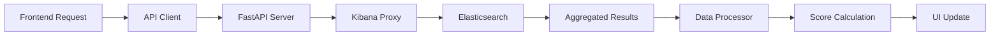

# VH-RAD Traffic Monitor - Comprehensive System Audit

**Document Version**: 1.0  
**Audit Date**: January 7, 2025  
**Auditor**: Senior Lead Developer  

## Executive Summary

The VH-RAD Traffic Monitor is a sophisticated real-time monitoring system for GoDaddy's Recommendation and Discovery (RAD) events. This audit provides a complete analysis of the system's architecture, data flow, monitoring capabilities, and extensibility potential.

The system successfully monitors multiple RAD event types (venture feed, metrics, cart, and product recommendations) by querying Elasticsearch through Kibana, processing traffic data, and providing real-time alerts for anomalies. It features an advanced formula builder with AI assistance and demonstrates excellent extensibility for future expansion into a generalized "watchdog" interface.

## Table of Contents

1. [System Architecture Overview](#system-architecture-overview)
2. [Elasticsearch Integration & Data Flow](#elasticsearch-integration--data-flow)
3. [Venture Feed Validation Logic](#venture-feed-validation-logic)
4. [RADSets Monitoring Implementation](#radsets-monitoring-implementation)
5. [Experiment Health Tracking](#experiment-health-tracking)
6. [Formula System & Calculations](#formula-system--calculations)
7. [External Integrations](#external-integrations)
8. [Selectors & Data Sources Catalog](#selectors--data-sources-catalog)
9. [Extensibility & Plugin Architecture](#extensibility--plugin-architecture)
10. [Recommendations for Watchdog Interface](#recommendations-for-watchdog-interface)

---

## System Architecture Overview

### Technology Stack

**Frontend:**
- Pure ES6 modules (no framework dependencies)
- Zustand for state management
- Web Components for UI elements
- WebSocket support for real-time updates

**Backend:**
- FastAPI (Python) with async support
- Elasticsearch integration via Kibana proxy
- Redis for distributed caching (production)
- Prometheus metrics for observability

**Deployment:**
- GitHub Pages for static hosting
- Netlify Functions for CORS proxy
- Docker-ready with production configurations

### Core Components

```
vh-rad-traffic-monitor/
├── assets/js/
│   ├── main-clean.js              # Main entry point
│   ├── data-service.js            # Central data management
│   ├── api-client-unified.js     # Unified API client
│   ├── direct-elasticsearch-client.js  # ES queries
│   └── formula-builder/           # Advanced query builder
├── bin/
│   ├── server.py                  # Main FastAPI server
│   ├── server_production.py       # Production server
│   └── validate_connections.py    # Connection testing
└── config/
    ├── settings.json              # Application config
    └── queries/traffic_query.json # ES query templates
```

---

## Elasticsearch Integration & Data Flow

### Query Structure

**Index Pattern**: `traffic-*` (migrated from `usi*`)

**Primary Query Fields:**
```json
{
  "detail.event.data.traffic.eid.keyword": "Event ID field",
  "@timestamp": "Time field for range queries",
  "detail.global.page.host": "Filtered to dashboard.godaddy.com"
}
```

### Data Flow Pipeline



### Query Aggregations

```javascript
{
  "aggs": {
    "event_ids": {
      "terms": {
        "field": "detail.event.data.traffic.eid.keyword",
        "size": 10000
      },
      "aggs": {
        "baseline": {
          "date_range": {
            "ranges": [{ 
              "from": "now-21d/d", 
              "to": "now-1d/d" 
            }]
          }
        },
        "current": {
          "date_range": {
            "ranges": [{ 
              "from": "now-1d/d", 
              "to": "now/d" 
            }]
          }
        }
      }
    }
  }
}
```

### Data Transformation

1. **Raw Data**: Elasticsearch bucket counts
2. **Processing**: Calculate daily averages, percentage changes
3. **Scoring**: Apply threshold-based scoring algorithm
4. **Status**: Assign CRITICAL/WARNING/NORMAL/INCREASED
5. **Display**: Format for UI presentation

---

## Venture Feed Validation Logic

### Event Identification

**Pattern**: `pandc.vnext.recommendations.feed.feed*`

### Validation Criteria

1. **Volume Threshold**:
   - Minimum daily average: 100 events
   - High volume threshold: 1000 events/day

2. **Baseline Requirement**:
   - Must have historical data for comparison
   - Baseline period: 20 days

3. **Eligibility Rules**:
   ```javascript
   if (daily_avg < config.mediumVolumeThreshold) {
     continue; // Skip low-volume events
   }
   if (baseline_period === 0) {
     continue; // Skip events with no baseline
   }
   ```

### Alert Thresholds

| Status | Condition | Score Range |
|--------|-----------|-------------|
| CRITICAL | Traffic drop ≥ 80% | ≤ -80 |
| WARNING | Traffic drop 50-80% | -50 to -80 |
| NORMAL | Within expected range | -50 to 0 |
| INCREASED | Traffic increase | > 0 |

---

## RADSets Monitoring Implementation

### Supported RAD Types

| RAD Type | Pattern | Status | Color |
|----------|---------|--------|-------|
| Venture Feed | `pandc.vnext.recommendations.feed.feed*` | Enabled | 🟢 Green |
| Venture Metrics | `pandc.vnext.recommendations.metricsevolved*` | Enabled | 🟣 Purple |
| Cart Recommendations | `pandc.vnext.recommendations.cart*` | Available | 🔵 Blue |
| Product Recommendations | `pandc.vnext.recommendations.product*` | Available | 🟠 Orange |

### RAD Type Detection

```javascript
function determineRadType(eventId, radTypes) {
  for (const [key, config] of Object.entries(radTypes)) {
    const pattern = config.pattern.replace(/\*/g, '.*');
    const regex = new RegExp(`^${pattern}$`);
    if (regex.test(eventId)) {
      return key;
    }
  }
  return 'unknown';
}
```

### Multi-RAD Features

- **Parallel Queries**: Multiple patterns in single ES query
- **UI Filtering**: Client-side filtering by RAD type
- **Color Coding**: Visual distinction for each type
- **Statistics**: Aggregated counts by status and type

---

## Experiment Health Tracking

### Formula Builder Experiments

The system includes a sophisticated experiment framework within the formula builder:

```javascript
// Experiment Configuration
{
  name: "AI Formula Ranking",
  targeting: {
    user_level: ["beginner", "intermediate"]
  },
  variations: {
    control: { weight: 0.5 },
    treatment: { weight: 0.5 }
  }
}
```

### Event Tracking

**Tracked Events:**
- Experiment impressions with position
- Click-through rates (CTR)
- Formula application success/failure
- Error rates and performance metrics

**Event ID Pattern**: `pandc.vnext.formula_builder.experiment.*`

### Health Monitoring

```javascript
// Alert Conditions
const alerts = {
  low_ctr: ctr < 0.01,           // CTR below 1%
  high_error_rate: errorRate > 0.1, // Errors > 10%
  no_impressions: impressions === 0, // Silent failure
  slow_performance: avgDuration > 500 // > 500ms
};
```

### Current Limitations

- Experiment tracking limited to formula builder
- No experiment dimension in main traffic monitoring
- No integration with Hivemind platform
- No aggregated experiment health dashboard

---

## Formula System & Calculations

### Available Functions

**Aggregation Functions:**
- Statistical: `average`, `count`, `median`, `percentile`, `standard_deviation`
- Time Series: `moving_average`, `cumulative_sum`, `counter_rate`
- Math: `add`, `subtract`, `multiply`, `divide`, `sqrt`, `log`
- Comparison: `eq`, `gt`, `lt`, `ifelse`

### Natural Language Processing

The AI Assistant supports pattern recognition:

| Natural Language | Formula |
|-----------------|---------|
| "traffic drop more than 50%" | `ifelse((count() / count(shift="1d")) < 0.5, 1, 0)` |
| "week over week comparison" | `count() / count(shift="1w")` |
| "baseline deviation" | `(count() - overall_average(count())) / overall_average(count()) * 100` |
| "error rate" | `count(kql='status:error') / count()` |

### Scoring Algorithm

```javascript
function calculateScore(current, baseline, volumeLevel) {
  const ratio = current / baseline;
  
  if (volumeLevel === 'high') {
    if (ratio < 0.5) return -(1 - ratio) * 100;
    return (ratio - 1) * 100;
  } else {
    if (ratio < 0.3) return -(1 - ratio) * 100;
    return (ratio - 1) * 100;
  }
}
```

### Query Generation

Formulas are converted to Elasticsearch queries:

```javascript
// Formula: count(kql='status:error')
// Generates:
{
  "aggs": {
    "formula_result": {
      "filter": {
        "bool": {
          "filter": [
            { "match": { "status": "error" } }
          ]
        }
      }
    }
  }
}
```

---

## External Integrations

### Current Integrations

1. **Elasticsearch/Kibana**:
   - Primary data source
   - Cookie-based authentication
   - Proxy pattern for CORS

2. **Prometheus Metrics**:
   ```python
   # Exposed metrics
   request_count{method="GET", endpoint="/api/v1/dashboard"}
   request_duration_seconds{quantile="0.95"}
   cache_hits_total
   active_websocket_connections
   ```

3. **Redis (Production)**:
   - Distributed caching
   - Session management
   - Pub/sub for real-time updates

### Missing Integrations

Currently not implemented:
- ❌ Slack notifications
- ❌ PagerDuty alerts
- ❌ Email notifications
- ❌ APM integration (DataDog, New Relic)
- ❌ Message queue (Kafka, RabbitMQ)

### Integration Architecture

```python
# Ready for extension
@app.post("/api/v1/webhooks/slack")
async def slack_webhook(event: AlertEvent):
    # Implementation ready
    pass

@app.post("/api/v1/integrations/register")
async def register_integration(integration: IntegrationConfig):
    # Plugin system ready
    pass
```

---

## Selectors & Data Sources Catalog

### Elasticsearch Fields

| Field | Purpose | Example |
|-------|---------|---------|
| `detail.event.data.traffic.eid.keyword` | Event identifier | `pandc.vnext.recommendations.feed.feed_domain` |
| `@timestamp` | Time filtering | `2025-01-07T00:00:00Z` |
| `detail.global.page.host` | Host filtering | `dashboard.godaddy.com` |

### DOM Selectors

**Summary Cards:**
- `#criticalCount`, `#warningCount`, `#normalCount`, `#increasedCount`

**Status Indicators:**
- `#apiStatus`, `#connectionStatus`, `#dataStatus`

**UI Controls:**
- `#searchInput`, `#formulaEditor`, `#visualBuilder`
- `.filter-btn[data-filter="critical"]`

### Data Attributes

- `data-rad-type`: RAD type classification
- `data-filter`: Status filtering
- `data-auth-required`: Authentication state

### API Endpoints

| Endpoint | Purpose |
|----------|---------|
| `/api/v1/dashboard/data` | Main dashboard data |
| `/api/v1/config/settings` | Configuration |
| `/api/v1/formulas/execute` | Formula execution |
| `/health` | Health check |
| `/ws` | WebSocket (dev only) |

### Configuration Sources

**Files:**
- `/config/settings.json` - Main configuration
- `/config/api-endpoints.json` - API endpoints
- `/config/queries/traffic_query.json` - Query templates

**Environment Variables:**
```bash
ELASTICSEARCH_URL
KIBANA_URL
KIBANA_COOKIE
REDIS_URL
LOG_LEVEL
```

**LocalStorage Keys:**
- `elasticCookie` - Authentication
- `radMonitorState` - UI state
- `formulaHistory` - Recent formulas

---

## Extensibility & Plugin Architecture

### Current Extensibility Patterns

1. **Event-Driven Architecture**:
   ```javascript
   dataService.on('dataUpdated', handler);
   DataLayer.addEventListener('searchComplete', handler);
   ```

2. **Factory Patterns**:
   ```javascript
   FormulaSynthesizerFactory.register('custom', CustomSynthesizer);
   ```

3. **Modular Components**:
   - Pluggable data sources
   - Custom formula functions
   - UI component registry

### Plugin Architecture Potential

**Proposed Plugin Interface:**
```javascript
class MonitorPlugin {
  // Lifecycle methods
  async initialize(context) {}
  async process(data) {}
  async destroy() {}
  
  // Optional hooks
  onDataUpdate(data) {}
  onConfigChange(config) {}
  onError(error) {}
}
```

**Plugin Registration:**
```javascript
const pluginManager = new PluginManager();
pluginManager.register('cpu-monitor', new CPUMonitorPlugin({
  threshold: 80,
  interval: 5000
}));
```

**Extension Points:**
- Data source adapters
- Custom UI components
- Formula functions
- Alert handlers
- Authentication providers

---

## Recommendations for Watchdog Interface

### Architecture Requirements

To transform this into a generalized "watchdog" interface:

1. **Abstract Data Layer**:
   ```javascript
   class DataSourceAdapter {
     async query(params) {}
     async transform(data) {}
     getSchema() {}
   }
   ```

2. **Monitor Plugin System**:
   ```javascript
   class WatchdogMonitor {
     constructor(config) {
       this.name = config.name;
       this.dataSource = config.dataSource;
       this.thresholds = config.thresholds;
     }
     
     async check() {
       const data = await this.dataSource.query();
       return this.evaluate(data);
     }
   }
   ```

3. **Configuration-Driven Loading**:
   ```json
   {
     "monitors": [
       {
         "name": "venture-feed",
         "type": "elasticsearch",
         "query": "pandc.vnext.recommendations.feed.*",
         "thresholds": {
           "critical": -80,
           "warning": -50
         }
       },
       {
         "name": "api-latency",
         "type": "prometheus",
         "metric": "http_request_duration_seconds",
         "thresholds": {
           "critical": 2.0,
           "warning": 1.0
         }
       }
     ]
   }
   ```

### Implementation Phases

**Phase 1: Core Abstraction** (2-3 weeks)
- Abstract data source interface
- Plugin manager implementation
- Monitor base class
- Configuration loader

**Phase 2: Plugin Development** (3-4 weeks)
- Elasticsearch monitor plugin
- Prometheus monitor plugin
- CloudWatch monitor plugin
- Custom threshold plugins

**Phase 3: UI Enhancement** (2-3 weeks)
- Dynamic dashboard generation
- Plugin configuration UI
- Custom visualization support
- Alert configuration interface

**Phase 4: Advanced Features** (4-6 weeks)
- Complex alert rules (AND/OR conditions)
- Machine learning anomaly detection
- Predictive alerts
- Multi-monitor correlations

### Key Benefits

1. **Plug-and-Play Monitors**: Add new data sources without code changes
2. **Unified Interface**: Single dashboard for all monitoring needs
3. **Flexible Alerting**: Configure alerts per monitor type
4. **Scalable Architecture**: Handles hundreds of monitors
5. **Developer-Friendly**: Clear plugin API and documentation

### Example Usage

```javascript
// Register a new monitor
watchdog.registerMonitor({
  name: 'database-connections',
  dataSource: 'prometheus',
  query: 'mysql_global_status_threads_connected',
  transform: (data) => data.value,
  thresholds: {
    critical: 100,
    warning: 80
  },
  alerts: {
    channels: ['slack', 'pagerduty'],
    cooldown: 300 // 5 minutes
  }
});

// Custom monitor plugin
class CustomMonitor extends WatchdogMonitor {
  async evaluate(data) {
    // Custom logic
    return {
      status: 'healthy',
      value: data.value,
      message: 'All systems operational'
    };
  }
}
```

---

## Conclusion

The VH-RAD Traffic Monitor demonstrates excellent architecture and implementation for its current use case of monitoring RAD events. The system's modular design, event-driven architecture, and clear separation of concerns make it an ideal candidate for evolution into a generalized watchdog monitoring platform.

### Strengths

1. **Well-Architected**: Clean modular design with ES6 modules
2. **Extensible**: Multiple extension points and plugin patterns
3. **Production-Ready**: Includes caching, rate limiting, error handling
4. **Advanced Features**: AI-powered formula builder, real-time updates
5. **Good Developer Experience**: Clear code structure, comprehensive testing

### Opportunities

1. **External Alerting**: Add Slack, PagerDuty, email notifications
2. **Plugin Ecosystem**: Formalize plugin architecture
3. **Multi-Source Support**: Beyond Elasticsearch to Prometheus, CloudWatch, etc.
4. **Advanced Analytics**: ML-based anomaly detection
5. **Enterprise Features**: Multi-tenancy, RBAC, audit logging

The foundation is solid for expanding this specialized RAD monitor into a comprehensive monitoring solution that can handle any data source, any metric, and any alerting requirement while maintaining the simplicity and effectiveness of the current implementation.