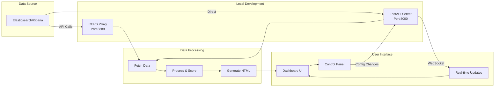
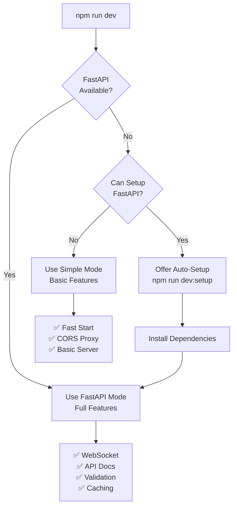

# RAD Monitor - Complete Architecture Diagram

## 🏗️ System Architecture Overview

This document provides a comprehensive visual representation of the RAD Monitor system architecture, showing how all components connect and interact.

## 📊 Complete System Architecture

```mermaid
graph TB
    subgraph "User Interface Layer"
        Browser[Web Browser]
        Console[Browser Console]
        DevTools[Developer Tools]
    end

    subgraph "Frontend - HTML/CSS Layer"
        HTML[index.html<br/>Main Dashboard]
        CSS[dashboard.css<br/>Styling]
        Template[index.html.template<br/>Dynamic Template]
    end

    subgraph "Frontend - JavaScript Modules"
        subgraph "Core Modules"
            Main[main.js<br/>Entry Point]
            DashboardMain[dashboard-main.js<br/>Dashboard Controller]
            DataLayer[data-layer.js<br/>State Management]
        end

        subgraph "UI Components"
            UIUpdater[ui-updater.js<br/>DOM Updates]
            ConsoleViz[console-visualizer.js<br/>ASCII Charts]
            ConfigManager[config-manager.js<br/>Settings UI]
        end

        subgraph "Data Processing"
            DataProcessor[data-processor.js<br/>Score Calculation]
            TimeRangeUtils[time-range-utils.js<br/>Time Parsing]
        end

        subgraph "API Layer"
            UnifiedAPI[api-interface.js<br/>Unified API]
            APIClient[api-client.js<br/>Legacy Client]
            FastAPIClient[api-client-fastapi.js<br/>FastAPI Client]
            FastAPIIntegration[fastapi-integration.js<br/>Feature Toggle]
            EnhancedClient[api-client-enhanced.js<br/>TypeScript Support]
        end
    end

    subgraph "Development Servers"
        UnifiedServer[dev_server_unified.py<br/>Smart Server]
        SimpleServer[dev_server.py<br/>Basic HTTP]
        FastAPIServer[dev_server_fastapi.py<br/>Full Features]
    end

    subgraph "Backend - Core Services"
        CORSProxy[cors_proxy.py<br/>CORS Handler]
        EnhancedProxy[cors_proxy_enhanced.py<br/>Typed CORS]
        HealthCheck[health_check.py<br/>System Status]
    end

    subgraph "Backend - Data Pipeline"
        Generator[generate_dashboard.py<br/>Dashboard Generator]

        subgraph "Data Processing Pipeline"
            ProcessData[src/data/process_data.py<br/>Orchestrator]
            Models[src/data/models.py<br/>Pydantic Models]

            subgraph "Processors"
                ScoreCalc[score_calculator.py<br/>Scoring Logic]
                TrafficProc[traffic_processor.py<br/>Traffic Analysis]
                HTMLGen[html_generator.py<br/>HTML Generation]
            end
        end
    end

    subgraph "Backend - API Endpoints"
        ConfigAPI[src/api/config_api.py<br/>Config Management]
        CentralAPI[centralized_api.py<br/>Unified Endpoints]
    end

    subgraph "External Services"
        Kibana[Kibana/Elasticsearch<br/>Data Source]
        GitHub[GitHub Pages<br/>Production Host]
        GitHubActions[GitHub Actions<br/>CI/CD]
    end

    subgraph "Configuration & Scripts"
        EnvConfig[.env / env.sample<br/>Environment]
        DashConfig[dashboard.config.sh<br/>Dashboard Config]
        Queries[queries/traffic_query.json<br/>ES Queries]

        subgraph "Shell Scripts"
            RunCORS[run_with_cors.sh]
            RunFastAPI[run_fastapi_dev.sh]
            TestLocally[test_locally.sh]
            Cleanup[cleanup-ports.sh]
            Validate[validate_connections.sh]
        end
    end

    subgraph "Testing Infrastructure"
        JSTests[JavaScript Tests<br/>Vitest]
        PyTests[Python Tests<br/>pytest]
        BashTests[Bash Tests<br/>bats]
        Integration[Integration Tests]
    end

    %% User Interactions
    Browser --> HTML
    Browser --> DevTools
    DevTools --> Console

    %% Frontend Flow
    HTML --> Main
    CSS --> HTML
    Main --> DashboardMain
    DashboardMain --> DataLayer
    DashboardMain --> UIUpdater
    DashboardMain --> ConfigManager
    DashboardMain --> UnifiedAPI

    %% UI Updates
    UIUpdater --> HTML
    ConsoleViz --> Console
    DataLayer --> ConsoleViz

    %% API Selection
    UnifiedAPI --> FastAPIIntegration
    FastAPIIntegration -->|FastAPI Mode| FastAPIClient
    FastAPIIntegration -->|Legacy Mode| APIClient
    FastAPIClient --> FastAPIServer
    APIClient --> CORSProxy
    EnhancedClient --> EnhancedProxy

    %% Data Processing
    UnifiedAPI --> DataProcessor
    DataProcessor --> DataLayer
    TimeRangeUtils --> DataProcessor

    %% Development Server Flow
    UnifiedServer -->|Auto-detect| SimpleServer
    UnifiedServer -->|Auto-detect| FastAPIServer
    SimpleServer --> CORSProxy
    FastAPIServer --> ConfigAPI
    FastAPIServer --> CentralAPI

    %% Backend Services
    CORSProxy --> Kibana
    EnhancedProxy --> Kibana
    FastAPIServer -->|WebSocket| Browser

    %% Data Generation Pipeline
    Generator --> ProcessData
    ProcessData --> Models
    ProcessData --> ScoreCalc
    ProcessData --> TrafficProc
    ProcessData --> HTMLGen
    HTMLGen --> Template
    Template --> HTML

    %% Configuration Flow
    EnvConfig --> Generator
    DashConfig --> Generator
    Queries --> Generator
    ConfigManager --> LocalStorage[LocalStorage]

    %% External Services
    CORSProxy --> Kibana
    GitHubActions --> Generator
    GitHubActions --> GitHub
    GitHub --> Browser

    %% Testing
    JSTests --> Main
    PyTests --> Generator
    BashTests --> RunCORS
    Integration --> UnifiedServer

    %% Styling
    classDef frontend fill:#e1f5fe,stroke:#01579b,stroke-width:2px
    classDef backend fill:#f3e5f5,stroke:#4a148c,stroke-width:2px
    classDef external fill:#fff3e0,stroke:#e65100,stroke-width:2px
    classDef config fill:#e8f5e9,stroke:#1b5e20,stroke-width:2px
    classDef test fill:#fce4ec,stroke:#880e4f,stroke-width:2px

    class Browser,Console,DevTools,HTML,CSS,Template,Main,DashboardMain,DataLayer,UIUpdater,ConsoleViz,ConfigManager,DataProcessor,TimeRangeUtils,UnifiedAPI,APIClient,FastAPIClient,FastAPIIntegration,EnhancedClient frontend
    class UnifiedServer,SimpleServer,FastAPIServer,CORSProxy,EnhancedProxy,HealthCheck,Generator,ProcessData,Models,ScoreCalc,TrafficProc,HTMLGen,ConfigAPI,CentralAPI backend
    class Kibana,GitHub,GitHubActions external
    class EnvConfig,DashConfig,Queries,RunCORS,RunFastAPI,TestLocally,Cleanup,Validate config
    class JSTests,PyTests,BashTests,Integration test
```



## 🔄 Data Flow Diagram



## 🚀 Server Mode Decision Flow



## 📁 Project Structure

```
rad_monitor/
├── 📄 Core Files
│   ├── index.html                      # Main dashboard (generated)
│   ├── package.json                    # Node.js configuration
│   ├── vitest.config.js               # Test configuration
│   └── README.md                      # Main documentation
│
├── 🎨 Frontend Assets (assets/)
│   ├── css/
│   │   └── dashboard.css              # Dashboard styling
│   ├── js/                            # JavaScript modules
│   │   ├── 🚀 Entry Points
│   │   │   ├── main.js                # Application entry
│   │   │   └── dashboard-main.js      # Dashboard controller
│   │   │
│   │   ├── 📊 State Management
│   │   │   ├── data-layer.js          # Centralized state
│   │   │   └── state-logging-demo.js  # Redux-style logging
│   │   │
│   │   ├── 🎯 API Integration
│   │   │   ├── api-interface.js       # Unified API
│   │   │   ├── api-client.js          # Legacy client
│   │   │   ├── api-client-fastapi.js  # FastAPI client
│   │   │   ├── api-client-enhanced.js # TypeScript support
│   │   │   └── fastapi-integration.js # Feature toggle
│   │   │
│   │   ├── 🎨 UI Components
│   │   │   ├── ui-updater.js          # DOM manipulation
│   │   │   ├── console-visualizer.js  # ASCII charts
│   │   │   └── config-manager.js      # Settings UI
│   │   │
│   │   ├── 🔧 Utilities
│   │   │   ├── data-processor.js      # Score calculation
│   │   │   └── time-range-utils.js    # Time parsing
│   │   │
│   │   └── 📘 Types
│   │       └── api-types.ts           # TypeScript definitions
│   │
│   └── templates/
│       └── index.html.template        # Dashboard template
│
├── 🐍 Backend Services
│   ├── 🚀 Development Servers
│   │   ├── dev_server_unified.py      # Smart auto-detect server
│   │   ├── dev_server.py              # Simple HTTP server
│   │   └── dev_server_fastapi.py      # Full FastAPI server
│   │
│   ├── 🌐 Proxy Services
│   │   ├── cors_proxy.py              # Basic CORS proxy
│   │   └── cors_proxy_enhanced.py     # Enhanced typed proxy
│   │
│   ├── 📊 Data Pipeline
│   │   ├── generate_dashboard.py      # Main generator
│   │   ├── health_check.py            # System health
│   │   └── centralized_api.py         # Unified endpoints
│   │
│   └── 🧹 Utilities
│       ├── cleanup_ports.py           # Port management
│       └── validate_connections.py    # Connection validation
│
├── 📦 Source Code (src/)
│   ├── api/
│   │   ├── __init__.py
│   │   └── config_api.py              # Configuration API
│   │
│   ├── data/
│   │   ├── __init__.py
│   │   ├── models.py                  # Pydantic models
│   │   ├── process_data.py            # Data orchestrator
│   │   └── processors/
│   │       ├── __init__.py
│   │       ├── score_calculator.py    # Scoring logic
│   │       ├── traffic_processor.py   # Traffic analysis
│   │       └── html_generator.py      # HTML generation
│   │
│   └── dashboard.js                   # Compatibility layer
│
├── ⚙️ Configuration (config/)
│   ├── dashboard.config.sh            # Environment variables
│   ├── env.example                    # Example configuration
│   └── queries/
│       └── traffic_query.json         # Elasticsearch queries
│
├── 📜 Scripts
│   ├── 🏃 Run Scripts
│   │   ├── run_with_cors.sh           # Standard development
│   │   ├── run_enhanced_cors.sh       # Enhanced proxy
│   │   ├── run_fastapi_dev.sh         # FastAPI server
│   │   └── setup_and_run.sh           # Setup helper
│   │
│   ├── 🧪 Test Scripts
│   │   ├── test_locally.sh            # Quick test
│   │   ├── test_refactored.sh         # Refactored tests
│   │   └── run_all_tests.sh           # Full test suite
│   │
│   ├── 🔧 Utility Scripts
│   │   ├── cleanup-ports.sh           # Port cleanup wrapper
│   │   ├── validate_connections.sh    # Connection validator
│   │   ├── ensure_correct_dashboard.sh # Dashboard validator
│   │   └── migrate_to_refactored.sh   # Migration helper
│   │
│   └── scripts/
│       ├── generate_dashboard_refactored.sh # Generator wrapper
│       └── lib/                       # Legacy libraries
│           ├── cookie_handler.sh
│           └── error_handler.sh
│
├── 🧪 Testing (tests/)
│   ├── JavaScript Tests (Vitest)
│   │   ├── *.test.js                  # Unit tests
│   │   ├── integration.test.js        # Integration tests
│   │   └── setup.js                   # Test setup
│   │
│   ├── Python Tests (pytest)
│   │   ├── test_*.py                  # Unit tests
│   │   ├── test_full_integration.py   # Full integration
│   │   └── requirements.txt           # Test dependencies
│   │
│   └── Bash Tests (bats)
│       ├── test_bash_scripts.bats     # Script tests
│       └── test_refactored_bash.bats  # Refactored tests
│
├── 📊 Data & Coverage
│   ├── data/
│   │   └── raw_response.json          # Latest API response
│   ├── coverage/                      # Test coverage reports
│   └── htmlcov/                       # HTML coverage reports
│
├── 🚀 CI/CD (.github/workflows/)
│   ├── update-dashboard.yml           # Auto-update (45 min)
│   ├── test.yml                       # PR tests
│   └── test-comprehensive.yml         # Full test suite
│
├── 📚 Documentation
│   ├── Architecture & Design
│   │   ├── README_graph.md            # This file
│   │   ├── REFACTORING_GUIDE.md       # Refactoring guide
│   │   └── INTEGRATION_SUMMARY.md     # Integration overview
│   │
│   ├── Migration Guides
│   │   ├── BASH_TO_PYTHON_MIGRATION.md
│   │   ├── MIGRATION_COMPLETE.md
│   │   └── UTILITIES_MIGRATION_COMPLETE.md
│   │
│   ├── Feature Documentation
│   │   ├── FASTAPI_INTEGRATION_STRATEGY.md
│   │   ├── INSPECTION_TIME_FEATURE.md
│   │   ├── PERFORMANCE_MONITORING_GUIDE.md
│   │   └── ENHANCED_PROXY_GUIDE.md
│   │
│   └── Development Guides
│       ├── DEV_SERVER_MERGER_GUIDE.md
│       ├── MERGER_IMPLEMENTATION_SUMMARY.md
│       └── CODE_REVIEW_ENHANCEMENTS.md
│
└── 🔧 Configuration Files
    ├── .gitignore                     # Git ignore patterns
    ├── .nojekyll                      # GitHub Pages config
    ├── requirements-enhanced.txt      # Python dependencies
    └── env.sample                     # Environment example
```

## 🔑 Key Integration Points

### 1. **Frontend ↔ Backend Communication**
- **Legacy Mode**: Browser → CORS Proxy → Elasticsearch
- **FastAPI Mode**: Browser → FastAPI Server → Elasticsearch
- **WebSocket**: Browser ↔ FastAPI Server (real-time)

### 2. **State Management Flow**
- User Action → ConfigManager → DataLayer → API → Backend
- Backend Response → DataProcessor → DataLayer → UIUpdater → DOM

### 3. **Development Server Intelligence**
- `npm run dev` → UnifiedServer → Environment Check → Mode Selection
- Automatic fallback: FastAPI → Simple Mode if unavailable

### 4. **Data Generation Pipeline**
1. GitHub Actions/Manual trigger → generate_dashboard.py
2. Fetch from Elasticsearch → process_data.py
3. Process with models.py → score_calculator.py
4. Generate HTML → html_generator.py → index.html

### 5. **Testing Architecture**
- Frontend: Vitest → JavaScript modules
- Backend: pytest → Python modules
- Scripts: bats → Shell scripts
- Integration: All layers together

## 📈 Performance Optimization Points

1. **Caching**: DataLayer caches API responses
2. **WebSocket**: Real-time updates without polling
3. **Lazy Loading**: Modules loaded on demand
4. **Request Batching**: FastAPI batches multiple queries
5. **Connection Pooling**: Reuses Elasticsearch connections

## 🛡️ Security Layers

1. **Authentication**: Elastic cookie validation
2. **CORS Protection**: Proxy handles cross-origin
3. **Input Validation**: Pydantic models validate all inputs
4. **Rate Limiting**: FastAPI implements request throttling
5. **Environment Variables**: Sensitive data in .env files

---

**Last Updated**: This architecture diagram reflects the current state of the RAD Monitor project with the unified development server and all recent enhancements.
