# Context Gathering Checklist - Team Quokka RADs & MCP Integration

## Purpose
This checklist ensures comprehensive context gathering for the MCP Formula Builder integration with GoDaddy's RAD system. Check off items as context is gathered.

## ✅ Completed Context Areas

### 1. RAD System Architecture
- [x] Basic RAD system overview
- [x] Synthesizer patterns and functions
- [x] Entity data structures
- [x] RADset definitions and purposes
- [x] API endpoints and interfaces
- [x] Performance targets and thresholds

### 2. Team Organization
- [x] Team Quokka ownership areas
- [x] Team capacity and velocity
- [x] Sprint planning and story allocation
- [x] Cross-team dependencies
- [x] Communication channels

### 3. Current State Analysis
- [x] Active RAD development (Airo Carousel, DOP)
- [x] vnext-graph migration status
- [x] Silent failure incident analysis
- [x] Current performance metrics
- [x] In-progress work items

### 4. Business Context
- [x] Revenue projections from experiments
- [x] Key business metrics (CVR, GCR)
- [x] Market opportunities (OLA, DOP)
- [x] Customer segments and targeting

### 5. Technical Implementation
- [x] GraphQL query patterns
- [x] Entity types and relationships
- [x] Event tracking (EIDs)
- [x] Monitoring infrastructure
- [x] Development tools

### 6. Testing & Quality
- [x] ET session methodology
- [x] Test account management
- [x] Bug tracking process
- [x] Experiment validation

### 7. Business Intelligence
- [x] KPI dashboards
- [x] Executive reporting
- [x] Competitive analysis
- [x] Market research integration
- [x] ROI calculations

## 🔲 Pending Context Areas

### 1. Scoring & Ranking Algorithms
- [ ] Detailed scorer function implementations
- [ ] Weighting factors and calculations
- [ ] GenAI ranking integration details
- [ ] Performance optimization strategies
- [ ] A/B test result incorporation

### 2. Customer Analytics
- [ ] Full user journey maps
- [ ] Conversion funnel analytics
- [ ] Engagement metrics definitions
- [ ] Lifetime value calculations
- [ ] Behavioral segmentation

### 3. Infrastructure & Operations
- [ ] Cost analysis and budgeting
- [ ] Resource utilization metrics
- [ ] Scaling strategies
- [ ] Disaster recovery plans
- [ ] SLA definitions

### 4. Security & Compliance
- [ ] Data privacy policies
- [ ] PII handling procedures
- [ ] Compliance requirements
- [ ] Security audit results
- [ ] Access control mechanisms

### 5. Advanced Testing
- [ ] Automated test suites
- [ ] Performance benchmarks
- [ ] Load testing results
- [ ] Integration test coverage
- [ ] Regression test strategies

### 6. Future Architecture
- [ ] Post-vnext-graph plans
- [ ] Microservices roadmap
- [ ] AI/ML expansion strategy
- [ ] Real-time personalization
- [ ] Platform modernization

### 7. Cross-Team Integration
- [ ] Editor team RAD usage
- [ ] Marketing team dependencies
- [ ] Platform team coordination
- [ ] Shared entity ownership
- [ ] Change management process

### 8. RAD Lifecycle
- [ ] Creation to deprecation flow
- [ ] Version control strategies
- [ ] Rollback procedures
- [ ] A/B test graduation
- [ ] Long-term maintenance

### 9. Developer Experience
- [ ] Onboarding documentation
- [ ] Development best practices
- [ ] Debugging strategies
- [ ] Tool recommendations
- [ ] Common pitfalls

## 🔨 Basheer Alkhalil Focus Areas (New Additions)

### 11. GraphQL Migration & Tooling
Based on VNEXT-67000 (PG Migration Tool Pipeline):
- [x] Automated GraphQL query extraction
- [x] Schema deprecation handling
- [x] Fragment resolution system
- [x] Multi-service architecture support
- [ ] GPT-assisted transformations
- [ ] Response validation frameworks
- [ ] Query performance optimization
- [ ] Universal migration pipelines

### 12. Silent Failure Prevention
Based on VNEXT-67248 (RAD Silent Failure Post-mortem):
- [x] Root cause analysis methodology
- [x] Entity field validation requirements
- [x] Synthesizer dependency checking
- [ ] Automated failure detection systems
- [ ] Revenue impact tracking
- [ ] Alert escalation procedures
- [ ] Post-mortem documentation standards

### 13. Testing Infrastructure Issues
Based on VNEXT-67513 & module system errors:
- [x] Module resolution problems
- [ ] Import/export error patterns
- [ ] Test environment configuration
- [ ] Dependency management in tests
- [ ] CI/CD pipeline optimization

### 14. Entity Migration Patterns
Based on VNEXT-54269 & vnext-graph work:
- [x] WAM General RADset migration
- [x] Projects to vnext-graph transition
- [x] Projectslite optimization
- [ ] Query transformation strategies
- [ ] Backward compatibility layers
- [ ] Performance benchmarking

### 15. Cross-Domain Issues
Based on various tickets:
- [ ] CORS handling (VNEXT-63779)
- [ ] Event tracking cleanup (VNEXT-64189)
- [ ] Experiment targeting issues
- [ ] Multi-domain venture resolution
- [ ] Error handling patterns

### 16. Developer Tools & Automation
- [ ] Storybook maintenance (VNEXT-65263)
- [ ] Hivemind client integration
- [ ] Insight analytics consolidation
- [ ] Automated code generation
- [ ] Schema validation tools

##  Context Relationship Diagram

```mermaid
graph TB
    %% Core MCP Integration
    MCP[MCP Formula Builder<br/>Integration] --> RAD[RAD System<br/>Architecture]

    %% RAD System Components
    RAD --> SYNTH[Synthesizers<br/>Eligibility Logic]
    RAD --> ENTITY[Entity System<br/>Data Sources]
    RAD --> API[RAD API<br/>Endpoints]

    %% Entity Evolution
    ENTITY --> PROJ[projects<br/>Legacy]
    ENTITY --> PROJLITE[projectslite<br/>Optimized]
    ENTITY --> VNEXTG[vnext-graph<br/>Modern GraphQL]

    %% Team Structure
    QUOKKA[Team Quokka<br/>VH Dashboard Owner] --> RADSETS[RADsets Managed]
    RADSETS --> VF[venture-feed<br/>Recommendations]
    RADSETS --> VM[venture-metrics<br/>Analytics]
    RADSETS --> DISC[discover<br/>Tiles]
    RADSETS --> SETUP[venture-setup<br/>Onboarding]
    RADSETS --> WAM[wam-general<br/>Action Plans]

    %% Business Impact
    VF --> EXP[Active Experiments]
    EXP --> DOP[DOP Monetization<br/>$374K-$450K]
    EXP --> OLA[OLA Integration<br/>$7M Opportunity]
    EXP --> GENAI[GenAI Ranking<br/>Feed Optimization]

    %% Technical Infrastructure
    RAD --> MONITOR[Monitoring<br/>& Alerts]
    MONITOR --> SPAQ[SPAQ Platform<br/>Performance]
    MONITOR --> EID[Event Tracking<br/>EIDs]
    MONITOR --> KIBANA[Kibana<br/>Dashboards]

    %% Development Workflow
    QUOKKA --> DEV[Development<br/>Process]
    DEV --> ET[ET Sessions<br/>Weekly Testing]
    DEV --> TOOLS[Dev Tools]
    TOOLS --> RADMIN[RAD Admin<br/>radar.uxp]
    TOOLS --> SWITCH[Switchboard<br/>Feature Flags]
    TOOLS --> HIVE[Hivemind<br/>Experiments]

    %% Quality & Testing
    ET --> TEST[Testing Strategy]
    TEST --> MANUAL[Manual ET<br/>Sessions]
    TEST --> AUTO[Automated Tests<br/>Needed]

    %% Incidents & Learning
    MONITOR --> INCIDENT[Silent Failure<br/>June 2025]
    INCIDENT --> LEARN[Lessons Learned]
    LEARN --> VALID[Validation<br/>Requirements]
    LEARN --> PERRAD[Per-RAD<br/>Monitoring]

    %% Cross-Team Dependencies
    RADSETS --> CROSS[Cross-Team<br/>Usage]
    CROSS --> EDITOR[Editor Team<br/>WAM Usage]
    CROSS --> MARKET[Marketing<br/>Teams]

    %% Future State
    VNEXTG --> FUTURE[Future<br/>Architecture]
    FUTURE --> AI[AI/ML<br/>Expansion]
    FUTURE --> REAL[Real-time<br/>Personalization]

    %% Basheer's Focus Areas
    BASHEER[Basheer's<br/>Focus Areas] --> GQLMIG[GraphQL<br/>Migration Tools]
    BASHEER --> SILENT[Silent Failure<br/>Prevention]
    BASHEER --> TESTINFRA[Testing<br/>Infrastructure]

    %% GraphQL Migration Details
    GQLMIG --> EXTRACT[Query<br/>Extraction]
    GQLMIG --> SCHEMA[Schema<br/>Deprecation]
    GQLMIG --> TRANSFORM[GPT-Assisted<br/>Transformations]

    %% Silent Failure Prevention
    SILENT --> ROOTCAUSE[Root Cause<br/>Analysis]
    SILENT --> FIELDVAL[Field<br/>Validation]
    SILENT --> REVENUE[Revenue Impact<br/>Tracking]

    %% Testing Infrastructure
    TESTINFRA --> MODULE[Module<br/>Resolution]
    TESTINFRA --> IMPORT[Import/Export<br/>Fixes]
    TESTINFRA --> CICD[CI/CD<br/>Optimization]

    %% Entity Migration Work
    VNEXTG --> MIGWORK[Migration<br/>Work]
    MIGWORK --> WAMMIG[WAM General<br/>Migration]
    MIGWORK --> COMPAT[Backward<br/>Compatibility]

    %% MCP Integration Points
    MCP -.->|Adopts| SYNTH
    MCP -.->|Implements| ENTITY
    MCP -.->|Leverages| MONITOR
    MCP -.->|Follows| DEV
    MCP -.->|Learns from| LEARN
    MCP -.->|Uses| GQLMIG
    MCP -.->|Prevents| SILENT

    %% Connections
    INCIDENT --> BASHEER
    GQLMIG --> VNEXTG
    TESTINFRA --> TEST
    SILENT --> MONITOR

    %% Style
    classDef core fill:#f9f,stroke:#333,stroke-width:4px
    classDef team fill:#bbf,stroke:#333,stroke-width:2px
    classDef tech fill:#bfb,stroke:#333,stroke-width:2px
    classDef business fill:#fbf,stroke:#333,stroke-width:2px
    classDef future fill:#ffd,stroke:#333,stroke-width:2px
    classDef basheer fill:#fbb,stroke:#333,stroke-width:3px

    class MCP,RAD core
    class QUOKKA,DEV,ET team
    class ENTITY,API,MONITOR,TOOLS tech
    class EXP,DOP,OLA business
    class FUTURE,AI,REAL future
    class BASHEER,GQLMIG,SILENT,TESTINFRA basheer
```

## 🎯 Priority Gathering Areas

Based on MCP Formula Builder needs, prioritize gathering context for:

1. **Scoring Algorithms** - Essential for formula ranking
2. **Customer Analytics** - Critical for understanding user needs
3. **Automated Testing** - Required for reliable integration
4. **Cross-Team Integration** - Necessary for smooth deployment
5. **Future Architecture** - Important for long-term planning

## 📋 Action Items

### Immediate (This Week)
- [ ] Deep dive into scorer function implementations
- [ ] Map complete user journey through RADs
- [ ] Document automated testing requirements
- [ ] Interview cross-team stakeholders

### Short Term (Next 2 Weeks)
- [ ] Analyze infrastructure costs and optimization
- [ ] Review security and compliance requirements
- [ ] Study RAD lifecycle management
- [ ] Gather developer experience feedback

### Medium Term (Next Month)
- [ ] Research future architecture plans
- [ ] Compile business intelligence metrics
- [ ] Document best practices from other teams
- [ ] Create comprehensive integration guide

## 🔗 Related Documents

1. **MCP_RAD_CONTEXT.md** - Primary context document
2. **TEAM_QUOKKA_2025_UPDATES.md** - Current state summary
3. **ADDITIONAL_CONTEXT_AREAS.md** - Deep dive topics
4. **COMPREHENSIVE_CONTEXT_SUMMARY.md** - High-level overview
5. **ET_SESSION_TEMPLATE.md** - Testing methodology
6. **QUOKKA_RECENT_RAD_SUMMARY.md** - Recent updates

## 👤 Basheer Alkhalil Key Contributions Summary

Based on research, Basheer Alkhalil (balkhalil@godaddy.com) has been instrumental in several critical areas:

### Major Projects:
1. **PG Migration Tool Pipeline (VNEXT-67000)**
   - Building automated GraphQL migration infrastructure
   - GPT-assisted query transformations
   - Universal design for any GraphQL service migration

2. **Silent Failure Post-Mortem (VNEXT-67248)**
   - Led investigation of critical RAD failures
   - Identified missing planType field issues
   - Proposed comprehensive monitoring solutions

3. **vnext-graph Entity Migration**
   - Leading WAM General RADset migration (VNEXT-54269)
   - Updating deprecated PG queries (VNEXT-65212)
   - Ensuring backward compatibility

4. **Testing Infrastructure Improvements**
   - Fixing module system errors (VNEXT-67513)
   - Resolving import/export issues in test environments
   - Improving CI/CD pipeline reliability

5. **Cross-Domain Technical Work**
   - CORS handling for MyProducts proxy (VNEXT-63779)
   - Event tracking cleanup with insight-analytics (VNEXT-64189)
   - Storybook maintenance and security updates (VNEXT-65263)

### Key Skills & Focus Areas:
- GraphQL schema migrations and tooling
- Automated testing and infrastructure
- Silent failure prevention and monitoring
- Entity data migration strategies
- Cross-team technical coordination

---
*Use this checklist to ensure comprehensive context gathering for successful MCP Formula Builder integration with the RAD system.*
